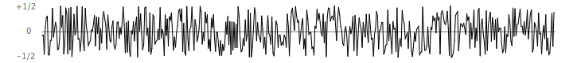
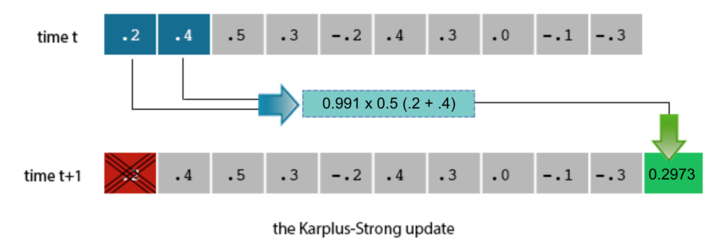
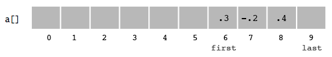
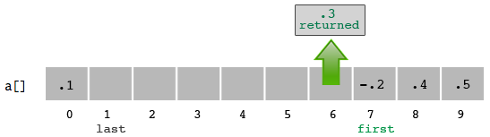

## Guitar Hero

---

### 0. Getting Started

---

#### A. Goals

The purpose of this assignment is to practice using object types and learn about object-oriented design principles. The specific goals are to:
- Learn how to create user-defined data types in Java.
- Implement and use a data structure.
- Simulate a musical instrument using your computer's keyboard using an algorithm.
- Learn about digital audio.

---

#### B. Background 

When you pluck a string on a musical instrument, the middle of the string bounces wildly up and down. Over time, the tension in the string causes it to move more regularly and less violently, until it finally comes to rest. High frequency strings have greater tension, which causes them to vibrate faster, but also to come to rest more quickly. Low frequency strings are looser, and vibrate longer.

In this assignment, you will write a program to simulate plucking a guitar string using the Karplus-Strong algorithm. This algorithm played a seminal role in the emergence of physically modeled sound synthesis (in which a physical description of a musical instrument is used to synthesize sound electronically).

From a mathematical physics viewpoint, the Karplus-Strong algorithm approximately solves the 1D wave equation, which describes the transverse motion of the string as a function of time.

---

#### C. Your program

You will write a program `Guitar.java` that uses a `RingBuffer` class and a MandolinString class to create a simulation of a guitar, implementing the Karplus-Strong algorithm.

--- 

#### D. Getting started

In Codio, you should see `RingBuffer.java`, `GuitarString.java`, and `MiniGuitar.java` `MiniGuitar.java` will help you test `RingBuffer` and `GuitarString`, and serve as a starting point for the full `Guitar` program that you will write.

---

### 1. Understanding the Assignment

The components that make the Karplus-Strong algorithm work are the ring buffer feedback mechanism and the averaging operation.

---

#### A. The Ring Buffer

We model the position of the string using a **ring buffer** data structure. The ring buffer models the medium (a string tied down at both ends) in which the energy travels back and forth. Sonically, the feedback mechanism reinforces only the fundamental frequency and its harmonics (frequencies at integer multiples of the fundamental).

We model a guitar string by sampling its displacement from the rest position at `numSamples` points that are equally spaced points in time. The displacement is a real number between -1/2 and +1/2 (0 represents the rest position itself), and `numSamples` is calculated as the **sampling rate** (44,100 Hz) divided by the fundamental frequency (rounding the quotient **up** to the nearest integer). For instance, each point in the image below represents a displacement of the string from the rest position.


A pluck of the string is modeled by filling the ring buffer with random values, just as a physical string bounces wildly when plucked. The string can contain energy at any frequency. We simulate a pluck with **white noise** by setting each of these `numSamples` displacements to a random real number between -1/2 and +1/2.



---

#### B. The Karplus-Strong Algorithm

After the string is plucked, it vibrates. The pluck causes a displacement which spreads wave-like over time. The Karplus-Strong algorithm simulates this vibration by repeatedly deleting the first sample from the ring buffer (.2 in the below example) and adding to the end of the buffer the average of the first two samples (.2 and .4), scaled by an **energy decay factor** of 0.991.



Averaging neighboring samples brings them closer together, which means the changes between neighboring samples become smaller and more regular. The decay factor reduces the overall amount that a given point on the string moves, so that it eventually comes to rest. The averaging operation serves as a gentle low-pass filter, removing higher frequencies while allowing lower frequencies to pass. Because it is in the path of the feedback, this has the effect of gradually attenuating the higher harmonics while keeping the lower ones, which corresponds closely with how a plucked guitar string sounds.

The ring buffer length determines the fundamental frequency of the note played by the string. Longer ring buffers are analogous to longer strings on practical instruments, which produce notes with lower frequencies. A long ring buffer goes through more random samples before getting to the first round of averaged samples. The result is that it will take more steps for the values in the buffer to become regular and to die out, modeling the longer reverberation time of a low string.

---

### 2. Help Resources

---

#### A. Frequently Asked Questions

[This document](https://docs.google.com/document/d/1rJj1TsKtGvAnP0hMfZNKUKJaOlahUxk34Zs689ajXkM/edit?usp=sharing) features a list of frequently asked questions about this assignment. Please refer to it if you have a question to see if the question is answered here _before_ posting on Piazza.

---

#### B. Help Video

To help understand the role of the RingBuffer better, take a look at this [video](https://www.youtube.com/watch?v=QjQvqg26qvM#action=share) made by a previous CIS 110 professor. Please watch the video before asking questions about RingBuffer on Piazza or in office hours.

---

### 3. `RingBuffer`

In this section you will write `RingBuffer` and test it in `RingBufferTest`. The ring buffer is the data structure that underpins the Karplus-Strong algorithm. `RingBuffer` will implement the following API:

```java
public class RingBuffer
-----------------------------------------------------------------------------------------
RingBuffer(int capacity)  // create an empty ring buffer, with given max capacity
int getFirst()            // get the value of the first variable - this is ONLY used for testing
int getLast()             // get the value of the last variable - this is ONLY used for testing
double[] getBuffer()      // get the array stored in bufferArray - this is ONLY used for testing 
int currentSize()         // return number of items currently in the buffer
boolean isEmpty()         // is the buffer empty?
boolean isFull()          // is the buffer full?
void enqueue(double x)    // add item x to the end
double dequeue()          // delete and return item from the front
double peek()             // return (but do not delete) item from the front
```

Start with the provided `RingBuffer.java` skeleton, then fill in the constructors and methods one by one. Compile frequently, and add code to `RingBufferTest` to test each method as you write it.


**You must follow the API above.** We will be testing the methods in the API directly. If your method has a different signature or does not behave as specified, you will lose a substantial number of points. You may not add public methods or instance variables to the API; however, you may add private methods (which are only accessible in the class in which they are declared). You may also add private instance variables for data that must be shared between methods.

In the skeleton file, we have already declared some instance variables for you:

```java
public class RingBuffer {
    private double[] bufferArray; // items in the buffer
    private int first;            // index for the next dequeue or peek
    private int last;             // index for the next enqueue
    private int currentSize;      // number of items in the buffer
}
```

---

#### A. Constructor

**`RingBuffer(int capacity)`** constructs a new ring buffer with the given `capacity` by allocating and initializing the `double` array `bufferArray` with length `capacity`. Observe that this allocation of `bufferArray` must occur in the constructor (and not when you declare the instance variables), since otherwise you would not know how big to make the array.

---

#### B. Ring Buffer Help Video

This [video](https://youtu.be/QjQvqg26qvM) should help you understand how RingBuffer works.

---

#### C. Methods

Write the remaining methods of `RingBuffer`.

On this assignment, you are required to test every function. You must write tests in `RingBufferTest.java`. This file will include JUnit tests for all your methods. The explicit testing requirements are below in section D. We encourage you to look at them as you are writing each method.

We recommend using Test Driven Development. That is, write the test that checks for the correct behavior BEFORE you attempt to code that behavior. We obviously cannot check what order your write your code in, but we encourage you to try it for this part of the assignment.

Every time you implement a method, immediately add code to test it through JUnit. We have also included a private method `printBufferContents()` that prints out the contents of a `RingBuffer` object for inspection. You can use this function in `main` to help you debug, but this function should not be used in your JUnit tests. If you add any instance variables of your own, you will need to update this method to print them out too.

**Test cases are a great area for collaboration!** You may not look at each other's code, but you are encouraged to discuss what test cases to implement with your classmates, and also to compare the output of your tests with each other. Just remember to note this in your readme. That is, note who you design test cases with.

For performance reasons, your implementation of `RingBuffer` must **wrap around** in the array. To do this, maintain one integer instance variable `first` that stores the index of the least recently inserted item; maintain a second integer instance variable `last` that stores the index one beyond the most recently inserted item. _Ring buffers that wrap around like this are very common in audio and graphics applications because they avoid allocating data or moving memory around. Remember that you will be updating your ring buffers 44,100 times per second. To manage that, each update has to do as little work as possible._

**`getFirst()`**,**`getLast()`**, and **`getBuffer()`** should be simple getters (a.k.a., accessors) that return the value of the variables first, last, and buffer. These should ONLY be used in your JUnit tests (inside the `RingBuffer` class, you should just use the variables `first`, `last`, and `bufferArray` directly.

**`isFull()`** and **`isEmpty()`** return whether buffer is at capacity and whether it is completely empty. Go ahead and write these now. You can do a little bit of testing already by checking whether the buffer created in `main` is full or empty. It should always be empty since you haven't added anything to it yet. Likewise, it should only be full if `capacity` is zero. Once you implement `enqueue` you'll be able fill up your buffers.

**`enqueue(double x)`** inserts the value of `x` at the end of the ring buffer, putting it at index `last` (and incrementing `last`). Test it by enqueuing a variety of different values in `main` and printing the contents of the object. Think about what situations might trigger errors and make sure you test them.

**`dequeue()`** removes an item, taking it from index `first` (and incrementing `first`). Mix calls to `dequeue()` with calls to `enqueue()` in your testing code. Print out values you `dequeue()` as well as the remaining contents of the buffer.

When either the `first` or `last` index is equal to the `capacity`, make that index wrap around by changing its value to `0`.

**`peek()`** returns the first item in the buffer without removing it. Mix some calls to `peek()` in with the rest of your testing code in `main`, and print what it returns to help test it.

**`currentSize()`** returns the number of items in the buffer. Keep in mind that the current size of the `RingBuffer` (the number of items in it) is not necessarily the same as the length of the array. To get an accurate count of the number of items in your `RingBuffer`, increment the instance variable `currentSize` each time you add an item, and decrement it each time you remove.

Here is a demonstration of how the `enqueue()` and `dequeue()` methods work:
- **Initial state**

- **`enqueue(0.5)`**

- **`enqueue(0.1)`**

- **`dequeue()`**


In the skeleton file, we have included exception-throwing statements that crash your program when the client attempts to `dequeue()` from an empty buffer or `enqueue()` into a full buffer. This is a mechanism for generating run-time errors in your program, and will help you identify bugs. (Remember: once your code is working properly, these conditions should never occur, so your program should never crash. But if you has a bug while you're developing it, you'd like your program to crash immediately so it's easier to debug.) The following is an example of a throw statement:

```java
if (isEmpty()) {
    throw new RuntimeException("ERROR: Attempting to dequeue from an empty buffer.");
}
```

Leave these statements in your code, as they will be useful when debugging future sections of the assignment.

---

#### D. Mandatory Testing

You must also submit `RingBufferTest.java`. It must test the following methods. You need to create this file from scratch. When writing your tests, use `getFirst()`, `getLast()`, `currentSize()` and `getBuffer()` to test the value of your RingBuffer fields. You will find it useful to write a boolean function in your test program that takes in two arrays and returns true if they are equal (same length and contents) and false if they are unequal. This is what you can use to test your `bufferArray` values.
- You are required to write at least one test for the constructor.
- You must write at least two tests each for `isEmpty()` and `isFull()` (so 4 tests total). You should have one test for both that returns false, and one test for both that returns true.
- You must have at least 3 tests each for `enqueue` and `dequeue` (so 6 tests total). At least one test for each must test the wrap-around effect of RingBuffer. At least one test for each must test the error condition (we covered JUnit tests for error conditions in class, check the code posted for March 15).
- You must have at least 2 tests for `peek()`. One of the tests should check for an error.

**Please add the following import statement after whatever existing imports you already have in RingBuferTest.java**. It is paramount that you do this as our submission tests will not work without it.

```java
import org.junit.Test;
```

For testing, you do have to check the array contents.

---

### 4. `GuitarString`

Next, write and test `GuitarString`, which uses `RingBuffer` to implement the Karplus-Strong algorithm. `GuitarString` should implement the following API:

```java
public class GuitarString
-------------------------------------------------------------------------------------------
GuitarString(double frequency)       // create a guitar string of the given frequency, 
                                   // using a sampling rate of 44,100
void pluck()                       // set the buffer to white noise
void tic()                         // advance the simulation one time step
double sample()                    // return the current sample
int time()                         // return the total amount of tics
```

The design of your `GuitarString` class should look like the provided `GuitarString.java` skeleton, except that you will need to fill in all of the constructors and methods.

Again, **you must follow the API above**. We will be testing the methods in the API directly. If your method has a different signature or does not behave as specified, you will lose a substantial number of points. You may not add public methods or instance variables to the API; however, you may add private methods (which are only accessible in the class in which they are declared). You may also add private instance variables for data that must be shared between methods.

---

#### A. Constructor

**`GuitarString(double frequency)`** creates a `RingBuffer` of capacity `numSamples`, where `numSamples` is the sampling rate of 44,100 Hz divided by `frequency`, rounded **up** to the nearest integer. (Hint: Check out `Math.ceil()`) The constructor then fills the `RingBuffer` to represent a guitar string at rest by enqueueing `numSamples` zeros. The constant `44100` should be declared as a `static` variable (because it is a constant value that is shared by all guitar strings that you create) in your `GuitarString` class. Do not hardcode it in your constructor. Remember that proper style for static variable names is to write them in all-caps with underscores to separate words.

Writing a reasonable test case for `GuitarString` is a bit of a pain, so we've included a `main` function to get you started. You are not required to use JUnit testing for GuitarString, and honestly we wouldn't recommend trying, since it requires more advanced JUnit techniques we haven't covered in class. Eventually you may to think about cases that aren't covered by what we provide you and add them. For now though – if your constructor works – the test we provide should at least create a string with a capacity of 10 that is initially full. The rest of the test that tics through a bunch of samples won't work until you implement the remaining methods.

---

#### B. Methods

**Reminder: none of these methods should call `getFirst()`, `getLast()`, or `getBuffer()`, as those methods only existed for the sake of testing in your JUnit files.** You should not use any of those three functions in `GuitarString` for any reason However, you will definitely need to use the other methods, such as `enqueue` and `dequeue`.

**`sample()`** should return the value of the item at the front of the ring buffer.

**`pluck()`** should replace all `numSamples` items in the ring buffer with `numSamples` random values between `-0.5` inclusive and `+0.5` exclusive. To implement this, use a combination of the `RingBuffer` methods to replace the buffer with random values between `-0.5` and `+0.5`.

**`tic()`** should apply the Karplus-Strong update: compute the average of the first two samples of the ring buffer, multiplied by the energy decay factor (`0.991`), delete the sample at the front of the ring buffer, then add the new sample to the end. The constant `0.991` should be declared as a static variable in your `GuitarString` class. Hint: don't rewrite functions you have already implemented.

**`time()`** should return the total number of times tic() was called.

---

#### C. Checkpoint

To test your `GuitarString` class, run it with the given test code in `main` with a command-line argument `numSamples`. The given test code creates a `GuitarString` from some samples, then runs `tic()` `numSamples` times, printing the values of `time()` and `sample()`.

**`NullPointerException`** – Check the line number provided in the stack trace. An object you are using in this line has not been initialized correctly, and thus has the value of `null`. Attempting to access variables or call functions on a `null` object will throw a `NullPointerException`.

This `main()` method does not test all methods. You may want to write your own code in `main()` to test all aspects of this class and convince yourself that everything is functioning properly. However, we will not be grading tests written for the `GuitarString` class. (You need not comment out any testing code that you add **in `main()`**).

```java
java GuitarString 25
testString.buffer.isEmpty(): false
testString.buffer.isFull():  true
     0   0.2000
     1   0.4000
     2   0.5000
     3   0.3000
     4  -0.2000
     5   0.4000
     6   0.3000
     7   0.0000
     8  -0.1000
     9  -0.3000
    10   0.2973
    11   0.4460
    12   0.3964
    13   0.0495
    14   0.0991
    15   0.3469
    16   0.1487
    17  -0.0496
    18  -0.1982
    19  -0.0013
    20   0.3683
    21   0.4174
    22   0.2210
    23   0.0737
    24   0.2210
```
---

### 5. `Guitar`

Write a program `Guitar.java` that simulates a 37-string guitar with notes ranging from 109 Hz to 872 Hz.

---

#### A. MiniGuitar

Read `MiniGuitar.java`. `MiniGuitar` is a two-string version of `Guitar` that you can use to test your `RingBuffer` and `GuitarString` classes before moving on to write `Guitar`.

Run `MiniGuitar`, and type the lowercase letters a and c into the PennDraw window to pluck the two strings. If you have completed `RingBuffer` and `GuitarString` correctly, run `MiniGuitar` to check to see that everything works properly. You should hear two different pitches corresponding to A and C every time you press the a and c keys.

`MiniGuitar` uses `PennDraw` to receive keystrokes and `StdAudio` to play sound.

Notice that `MiniGuitar` adds the samples of the `GuitarString`s (i.e. superposes them) to compute the sound sample to play.

Notice how `MiniGuitar` uses an infinite loop to continually receive keystrokes from the user and generate new music samples. This infinite loop ends when the program terminates.

**Error: `dequeue/peek from an empty buffer` in `MiniGuitar`** – You may not have initialized the ring buffer to contain `numSamples` zeros in your `GuitarString(double frequency)` constructor.

**Lack of sound when running `MiniGuitar` for the first time** – Make sure you have tested `GuitarString` with the `main()` provided in the skeleton file. If that works, it is likely something wrong with `pluck()` since the `main()` provided for `GuitarString` does not test that method. To diagnose the problem, print out the values of `sample()` and check that they become nonzero after you type the **lower case** characters a and c.

**Clicking when running `MiniGuitar` (either one click, or continual clicking)** – It's likely that `pluck()` is working, but `tic()` is not. The best test is to run the `main()` provided for `GuitarString`.

---

#### B. `Guitar`

Model your `Guitar` class on the given `MiniGuitar` code. Where `MiniGuitar` had two `GuitarString`s, `Guitar` has 37.

`Guitar` should behave such that when a character of `NOTE_MAPPING` (defined below) is pressed, `Guitar` plays the corresponding note. The character at index _i_ of `NOTE_MAPPING` corresponds to a `GuitarString` frequency of 436 × 2<sup>(i - 24) / 12</sup>, so that the character `'q'` (character index `0` of `NOTE_MAPPING`) is 110 Hz, `'i'` (index `12`) is 218 Hz, `'v'` (index `24`) is 436 Hz, and `' '` (index `36`) is 872 Hz. You should declare a static variable in `Guitar` for the value `436.0` and for `NOTE_MAPPING` (but you need not do so for `24` and `12`).

```java
String NOTE_MAPPING = "q2we4r5ty7u8i9op-[=zxdcfvgbnjmk,.;/' ";
```

This keyboard arrangement imitates a piano keyboard: the "white keys" are on the qwertyuiop[ and zxcvbnm'./ rows and the "black keys" on the 1234567890-= and asdfghjkl;, rows of the standard US QWERTY keyboard layout.
 

The number `37` should not appear anywhere in your code. Don't even think of using 37 individual `GuitarString` variables or a 37-way `if` statement. Instead, create an array of `GuitarString` objects and use `NOTE_MAPPING.indexOf(key)` to figure out which key was typed, if any. Make sure your program does not crash if a key is played that is not one of your notes. (`indexOf()` returns `-1` if the string does not contain the character `key`.)

You need not worry about calling `StdAudio.play()` with a value greater than 1.0 or less than -1.0. `StdAudio.play()` automatically clips the value to within the range `1.0` to `-1.0`.

---

#### C. Checkpoint

**Comment out all print statements in your loop when testing `Guitar`**. Because print statements take time, they delay the computation of samples, and so your speaker will not receive samples at the rate of 44,100 per second needed to make a meaningful sound.

Once you've completed `Guitar`, try playing this familiar melody by pressing the keys below, pressing space where `S` is denoted.

```java
nn//SS/ ..,,mmn //..,,m //..,,m nn//SS/ ..,,mmn
```

Type the following into your guitar to get the beginning of Led Zeppelin's **Stairway to Heaven**. Multiple notes in a column are dyads and chords.

```java
                                              w q q
        8       u       7       y             o p p
i p z v b z p b n z p n d [ i d z p i p z p i u i i
```

---

### 6. Extra Credit

There are many ways to build on `Guitar.java`. Some of these can earn extra credit. Others cannot, but are included below for you to implement if you are interested.

---

#### A. Extra Credit 1

Write a program `VisualGuitar.java` (by modifying `Guitar.java`) that plots the sound wave in real-time using `PennDraw`, as the user is playing the keyboard guitar. The output could look something like this, but change over time. You are free to be as creative as you wish with your visualization, as long as the visualization is driven by the sound samples being emitted.


There are lots of different ways to visualize the sound, and any kind of animation that is tied to the sound samples is just fine. If you want to plot the sound wave similar to the figure above, you'll find the `PennDraw.point()` and `PennDraw.polyLine()` functions useful, although there are other options that also work fine.

If you draw lots of points, first call `PennDraw.setPenRadius(0)` once. This ensures that each point is a single pixel, and they will draw faster. (This is not conceptually interesting; it's a performance hack in the `PennDraw` implementation.)

Do not redraw the wave (or whatever animation you choose to make) on every sample because `PennDraw` will not be able to keep up. Instead, set a lower frame rate, and draw a batch of samples at a time. (For instance, you might set the frame rate to 44.1 and draw a new image every 1000 sound samples.) Experiment with different frame rates to find one that you think looks good and draws smoothly. There is more than one way to handle the drawing – there is no "right" way to do this.

---

#### B. Extra Credit 2

Come to office hours the week after this homework is due and perform a piece for your TA. You may perform in groups if you wish, and you may use a modified version of your program for the performance if you wish.

---

#### C. Challenge for the Bored

The ideas below are purely for you own enjoyment if you want to explore further. They are not worth any extra credit, and you will not submit them. They're just for fun.

**Do not make these modifications in the version of the `RingBuffer.java`, `GuitarString.java`, or `Guitar.java` that you submit. Instead, make new copies of these files with different names, and experiment in your new files.**

Modify the Karplus-Strong algorithm to synthesize a different instrument. Consider changing the excitation of the string (from white noise to something more structured) or changing the averaging formula (from the average of the first two samples to a more complicated rule) or anything else you might imagine. This is a challenge for the bored, so you will not receive extra credit for it, but you may use these suggestions as the basis for your visualization or your performance in class.

Alexander Strong suggests a few simple variants you can try:
- **Stretched tuning** – The frequency formula in the assignment uses "perfect tuning" that does not sound equally good in every key. Instead, most musicians use stretched tuning that equalizes the distortions across all keys. To get stretched tuning, using the formula _f_ = 440 × 1.05956<sup>i - 24</sup>. Try experimenting a bit with the base of the exponent to see what sounds best.
- **Extra notes** – Add additional keys to your keyboard string to play additional notes (higher or lower). Higher notes, especially, will benefit from stretched tuning. You will need to update the `24` in your frequency formula to change the frequency of the lowest note.
- **Better decay factors** – Make the decay factor dependent on the string frequency. Lower notes should have a higher decay factor; higher notes should have a smaller decay. Try different formulas and see what sounds best.
- **Harp strings** – Using a decay factor of `-0.997` in `tic()` will change the sound from guitar-like to harp-like. You may want to play with the decay factors and note frequencies to improve the realism.
- **Drums** – Randomly flipping (with probability 0.5) the sign of the new value before enqueueing it in `tic()` will produce a drum sound. You will need lower frequencies for the drums than for the guitar and guitar, and will want to use a decay factor of 1.0 (no decay). The note frequencies for the drums should also be spaced further apart.
- **Mix and match** – Assign some keyboard keys to drums, others to guitar, and still others to guitar (or any other instruments you invent) so you can play an ensemble.

---

#### D. Enrichment
- **Citation** – The original paper describing this algorithm, including many variants and a mathematical derivation of why it works: Kevin Karplus, and Alexander Strong. "[Digital Synthesis of Plucked-String and Drum Timbres](http://www.jstor.org/stable/3680062)". Computer Music Journal Vol. 7, No. 2 (Summer 1983), pp. 43-55. To access the full article, follow the link, then, click on "Login" in the upper right. Select "University of Pennsylvania" as your institution, and you will be able to log in with using your PennKey. (If you are on the Penn network, you may not need to log in.)
- **ChucK** – [ChucK](http://chuck.cs.princeton.edu/) is a specialized programming language for real-time synthesis, composition, and performance, originated by [Ge Wang](https://ccrma.stanford.edu/~ge) and [Perry Cook](http://www.cs.princeton.edu/~prc/) at Princeton University. Here's the [Karplus-Strong algorithm in ChucK](http://chuck.cs.princeton.edu/doc/examples/deep/plu.ck).
- **Slide flute** – Here is a description of a physically modeled [slide flute](http://ccrma.stanford.edu/software/clm/compmus/clm-tutorials/pm.html) by Perry Cook.

---

### 7. Readme and Submission

---

#### A. Readme

Complete `readme_guitarhero.txt` in the same way that you have done for previous assignments.

---

#### B. Submission

Submit `RingBuffer.java`, `RingBufferTest.java`, `GuitarString.java`, `Guitar.java`, and `readme_guitarhero.txt` on Gradescope.

You may also submit `VisualGuitar.java` for Extra Credit 1. If your `VisualGuitar` program requires any additional files, you may submit them in a compressed file named `extra.zip`.

**You may not submit any modifications from the "Challenge for the Bored" section in the `RingBuffer.java`, `GuitarString.java`, or `Guitar.java` files.**
