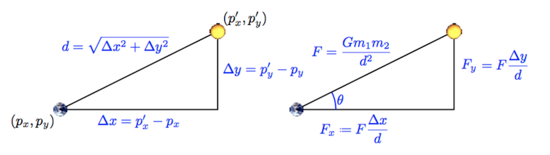

# NBody
## 0. Getting started 


### A. Goals

The goal of the NBody assignment is to familiarize you with arrays, iteration, graphics, and Java command-line arguments. The specific goals are to:

*   Learn about a scientific computing application
*   Learn to build up complex results using a sequence of simple statements
*   Reinforce understanding of animations
*   Use nested loops
*   Use arrays
*   Use Java command-line arguments

At the end of this assignment, you will have produced a visual simulation of the gravitational interactions among particles in two dimensions.


### B. Background

In 1687, in his famous _Principia_, Sir Isaac Newton formulated the principles governing the motion of two particles under the influence of their mutual gravitational attraction. However, Newton was unable to solve the problem for three particles. Indeed, in general, systems of three or more particles can only be solved numerically. An N-body simulation approximates the motion of particles which interact with one another via physical forces (like gravitational force). This type of simulation is widely used in astrophysics to predict how certain systems of particles (like planets in a solar system) interact with one another. 

Your challenge in this assignment is to write a program to simulate the motion of a designated number of particles in a plane that are mutually affected by gravitational forces, and animate the results. Similar implementations are widely used in astronomy, semiconductors, and fluid dynamics to study complex physical systems. Scientists also apply the same techniques to other pairwise interactions including Coulombic, Biot-Savart, and van der Waals. 

We provide all the formulas you need in the assignment. Don't worry if you don't fully understand the mathematics behind them – this is neither a physics nor a math course. **Instead, focus on the computer science task: building up a complicated result through a series of simple statements.**


### C. Your program

We are going to use Newton's universal law of gravitation and Java to simulate the manner in which celestial bodies (particles) interact. Since we are most familiar with the solar system, our primary goal is to create a simulation showing the planets (Mercury through Mars) orbiting around the Sun. Here's what your end result will look like.

[](https://www.youtube.com/watch?time_continue=1&v=pj2ZaOimGvc&feature=emb_logo "end_result.png")


Each body (planet) in the simulation has three characteristics that define its movement: its position, its velocity (the speed and direction of movement), and its acceleration (the direction and rate of change of the body’s velocity).


### D. Getting started

**CIS 110 is an introduction to computer programming class so we do not assume any physics background for the students.**

Create a Java class called `NBody` with an empty `main()` function. Give your file a class header.

You should see many image files and solarsystem.txt on the left in Codio. Reach out to course staff if you don't.

If you need to download the original files again, you can find them [here](hw02_base/hw02_base.zip).


### E. Advice

*   Compile, run, and debug frequently; make one small change at a time, ensuring that your program works as you expect it to after each change.
*   Be certain to debug and test your program as you go. Even if you have not yet gotten to steps with graphical output, you can test your program easily by adding in temporary `System.out.println()` statements. For instance, if you read in a variable, print its value to check that the value of the variable is the value you expect. If you do a computation, print out the result and check it. Once you're certain the variable is correct, you should remove these temporary `System.out.println()` statements.
    *   If you are not getting the outputs you expect, print out the value of variables at different points in the program (i.e. before a loop, inside the body of a loop, and/or after the loop)
    *   Comment out these statements before you submit
*   Keep your code organized by using indentation and avoiding too many blank lines.
*   Comment frequently (this helps you and others understand the code) and use descriptive variable names.
*   Examine debugging errors in the console for clues as to what went wrong.

### F. Physics Background 

**Here is a [video explaining the physics background](https://drive.google.com/file/d/1k7Xrq2HEg4T86Fa8-GI3gftMWLt4wx7J/view) for this assignment. One of our former TAs (alumnus) was kind enough to create this brief video that runs through the basics of the assignment.**

At each “timestep” (a value you will be given which represents the duration of a single step of the simulation), you will draw all bodies in their proper location which will be determined by the given displacement equations. Then, for each pair of bodies A and B, you will find the gravitational force that B exerts on A based on their respective masses and the distance between them using Newton’s Law of Gravitation (given). Since there is a force acting on A, Newton’s Second Law of Motion predicts that A will accelerate (i.e., its velocity will change). You will then compute A's new velocity. After finding the new velocities of all of the bodies, you will compute their new positions, which will be displayed on the simulation (redrawn once per timestep). 


## 1. Command Line Arguments


### A. Refresher: Using command-line arguments

Study the following program.

A Java program can take arguments when it is executed from the command-line in the terminal. These arguments are passed to the `main()` function as an array of strings called `args`; thus, the first command-line argument is `args[0]`, the second is `args[1]`, and so on.


```java
public class CommandLineArguments {
    public static void main(String[] args) {
        System.out.println(args.length);
        System.out.println(args[0]);
        System.out.println(Double.parseDouble(args[1]));
        System.out.println(Integer.parseInt(args[2]));
    }
}
```


Compile this program (you may cut and paste it into Codio) and run it by clicking Run on the toolbar. What happens?

In the Terminal window that opened when you compiled, enter these commands as the prompt:


*   `java CommandLineArguments Max 2.0 3`
*   `java CommandLineArguments`
*   `java CommandLineArguments Max`
*   `java CommandLineArguments Max 2.0 3 Michael`
*   `java CommandLineArguments Sierra Rachel 3`
*   `java CommandLineArguments Michael 2 3`
*   `java CommandLineArguments Sierra 2 3.0`

Make sure you understand each line of code, and why you get the output and runtime errors that you do for each set of command-line arguments. 


### B. Setting up command-line arguments

Your `NBody` program will take three command-line arguments: [in this order]


*   A double, `simulationTime`, that represents the time at which the simulation should end (total time of the simulation)
*   A double, `timeStep`, that represents the time quantum (the rate at which the simulation proceeds)
*   A string, `filename`, which is the name of the file containing the universe information (the bodies in the universe and each body’s unique features)

Declare these variables and initialize their values to the first, second, and third command-line arguments given to your program, respectively. You will use these variables later in your `NBody` program. 


### C. Checkpoint

Compile `NBody`, and run it with the arguments 15778000.0, 25000.0,  (simulationTime, timeStep) and `solarSystem.txt`. Since you are passing in command-line arguments, you must run the program from the terminal (see the command-line arguments refresher) rather than simply clicking “Run”.  Your program should not crash. If it does, use `System.out.println()` to identify the bug in your code. **Any debugging code that you add should be commented out when you submit.**


## 2. Reading from a File

The specifications (universe information) for the simulation are provided in a text file that provides the list of all bodies, their masses, initial positions, image file names, etc. By storing the universe information in a separate file, we can use a general reader in our program that can load different universe information (depending on the text file used) to simulate a variety of scenarios (different universe files and all images are provided in the zip file you downloaded). 


### A. Input file format

The text files containing universe information are provided in the following format.


```
5        numBodies 
2.50e+11 radius 
5.97400e+24  1.49600e+11  0.00000e+00  0.00000e+00  2.98000e+04    earth.gif
6.41900e+23  2.27900e+11  0.00000e+00  0.00000e+00  2.41000e+04     mars.gif
3.30200e+23  5.79000e+10  0.00000e+00  0.00000e+00  4.79000e+04  mercury.gif
1.98900e+30  0.00000e+00  0.00000e+00  0.00000e+00  0.00000e+00      sun.gif
4.86900e+24  1.08200e+11  0.00000e+00  0.00000e+00  3.50000e+04    venus.gif
m[]          px[]         py[]         vx[]         vy[]             img[]
```


In this file,


*   `numBodies` is the number of bodies in the simulation
*   `radius` is the **radius** of the universe; your simulation will assume that all bodies will have x- and y-coordinates between `-radius` and `radius`
*   There will be `numBodies` rows remaining in the file, each containing six values (columns):
    *   `m[]` is the mass of the body in kilograms (m)
    *   `px[]` and `py[]` are the initial x- and y-coordinates of the body in meters ($p_x$, $p_y$)
    *   `vx[]` and `vy[]` are the initial x- and y-components of the body velocity in meters per second ($v_x$, $v_y$)
    *   `img[]` is the filename of the image file used to represent the body in the simulation


### B. Setting up a File Reader

The standard library provides the class  `In.java` to support accessing information from a file. Study `StudentsFileProcessor.java`, which is provided in Codio. This file provides an example of reading information from a file. Compile `StudentsFileProcessor.java`, and run it from the Codio terminal with the argument `students.txt`:


```
java StudentsFileProcessor students.txt
```


In your `NBody` class, declare and initialize a variable, `inStream`, as below:


```
In inStream = new In(filename); // creates a variable inStream of type In to read from the file
```


inStream is just a variable name. Technically, you could name this variable anything, but for convenience we are giving you the name “inStream” for your file reader variable. 


### C. Reading values from the file

Now that `inStream` is initialized, you can access/read information from it using the following function calls. These functions behave identically to those in `StdIn`. Below, you will see that each value read from the file (accessed via inStream) is immediately stored in a variable (i.e. b, i, d, s).


```java
boolean b = inStream.isEmpty();     // boolean value that is true if there are no more values, false otherwise
int     i = inStream.readInt();     // reads in an int from inStream
double  d = inStream.readDouble();  // reads in a double from inStream
boolean b = inStream.readBoolean(); // reads in a boolean from inStream
String  s = inStream.readString();  // reads in a string from inStream
String  s = inStream.readLine();    // reads in an entire line from inStream
String  s = inStream.readAll();     // reads in the entire file from inStream
```


`inStream` will start reading from the beginning of the file (top left). Each time a function like `readDouble()` is called, `inStream` attempts to read the next (unread) number as a double (an error will occur if it cannot be parsed to a double). The next time a read function is called, `inStream` moves to the next item in the file.

For example, say that a file, `sample.txt`, is as follows:


```
4 5
```


The code snippet


```java
In inStream = new In("sample.txt");
int x = inStream.readInt();
double y = inStream.readDouble();
```


will set variable `x` to 4 and variable `y` to 5.0.

In your `NBody` program, declare an integer variable `numBodies` and a double variable `radius`. Using the above functions, initialize  `numBodies` and `radius` to the first and second values in the file, respectively.


### D. Reading arrays from the file

Declare five double arrays `m`, `px`, `py`, `vx`, and `vy`, and a String array `img`, and initialize them to length `numBodies`. Use the `inStream` functions and a loop to read all of the values in the file and store them in the appropriate array, at the appropriate index. The file will be read from left to right and will automatically go to the next line when there are no more values in a row. Think of how you can use a loop and order your function calls to read the file and store values efficiently (it is not complicated and the code within the loop need not exceed 8 lines). 


### E. Checkpoint

Copy the code below and paste it at the end of your `main()` function. This code will print out the contents of your six arrays and make it easy to see if you’ve stored the file values correctly.


```java
System.out.printf("%d\n", numBodies);
System.out.printf("%.2e\n", radius);
for (int i = 0; i < numBodies; i++) {
    System.out.printf("%12.5e %12.5e %12.5e %12.5e %12.5e %12s\n", m[i], px[i], py[i], vx[i], vy[i], img[i]);
}
```


Compile your program and run it with the same command-line arguments: 15778000.0, 25000.0, and `solarSystem.txt`. Note that by pressing `↑` (up arrow) you can recall commands previously typed into the terminal. When you run your file now, the output from the terminal should exactly match the text in the file `solarSystem.txt`. If your program crashes or if the output is different, use `System.out.println()`statements to identify and fix the bug. 


## 3. Drawing


### A. Drawing the background

Use


```java
PennDraw.setXscale(-radius, radius);
PennDraw.setYscale(-radius, radius);
```


to set the coordinates of the simulation window.

Use `PennDraw.picture()` function to draw the image `starfield.jpg` (provided in the zip file) in the center of the window.


### B. Drawing bodies

Write a loop that draws each particle in the correct position, on top of the background image. The position of the ith particle is (`px[i]`, `py[i]`), and the image to be used is `img[i]`.


### C. Checkpoint

Compile and run your program now using the same command-line arguments: 15778000.0, 25000.0, and `solarSystem.txt`. You should now see five bodies drawn (the Sun, Mercury, Venus, Earth, and Mars) in a line, stationary, on a starfield background image.

## 4. Particle Movement
The motion of particles is governed by a set of equations known as Newton's Laws of Motion and Gravitation. (At the scale of the galaxy, we can treat planets as particles.) The equations contain two basic parts: **velocity**, which is the speed and direction that a particle is moving in, and **acceleration**, which is the change in speed and direction. Particles always move in a straight line at a constant speed unless some outside force (e.g. friction, gravity, or a push) accelerates it. In our simulation, the only force is gravity. However, we will FIRST implement a simpler universe without gravity and test to make sure that it works. 

Although we think of time as advancing continuously and of objects as moving continuously, computers are not good at simulating constant change. Instead, we settle for letting time jump forward in discrete time steps of Δt (`timeStep`, which your program already reads as the second command-line argument). This variable is called the **time quantum** and is measured in seconds. Particles will simply jump from the old position to the new position at each time step. By setting timeStep to a very small value, we can get an accurate simulation, but the number of computations will be large. Setting timeStep to a very large number will speed up the simulation, but it will not be very accurate (it will be difficult to see a clear pattern of movement). 

[F.Y.I.]: This simulation scheme is called the **leapfrog finite difference approximation scheme**. It numerically integrates Newton's equations, and is the basis for most astrophysical simulations of gravitational systems. _Don’t worry about this, it’s just background information if you’re interested!_


### A. The time loop

First declare a variable that represents the total elapsed time of your simulation (elapsedTime will equal timeStep multiplied by the number of times the loop has run). Add a loop (“the time loop”) around the code you’ve written to draw the background and bodies at their initial positions. The elapsed time increases by `timeStep` once per iteration of the loop, and the simulation continues as long as the elapsed time is less than `simulationTime`. **The previous information indicates how to set up the conditions of your loop.**

**Before** the time loop, add a call to the PennDraw function, enableAnimation (`PennDraw.enableAnimation(30))` which will enable animation at 30fps (frames per second). `enableAnimation()` will make the simulation proceed in a visually smooth manner between each iteration of the time loop. You may adjust the frame rate as you see fit. (decrease the frame rate a lot to see how the particles are moving from frame to frame; increase it to get to the end of the simulation faster).

Within your time loop, add a call to `PennDraw.advance()` _after_ drawing all the bodies. This is necessary for the PennDraw animation to work.

**After** the time loop, add the given code from **Checkpoint 2E**. 

The time loop is where the simulation is created. Thus, any code which pertains to the simulation should be placed in the time loop. 


### B. Updating body positions

Inside the time loop, before redrawing the particles, change the position of each of the bodies. First think about updating variables; re-drawing will come later. For the original values of position: ($p_x$, $p_y$) the resultant values (the new $p_x$ and $p_y$) should be calculated with the following equations: 

**$p_{x_{new}} = p_x + \Delta t * v_x$**

**$p_{y_{new}} = p_y + \Delta t * v_y$**

**($\Delta t$ represents the timeStep)**


### C. Checkpoint

Compile and run your program with the same arguments from the previous checkpoints. You should now see an unmoving Sun the center of the window, and the four planets moving straight up and off the screen. The planets do this because the initial velocities given  in `solarSystem.txt` all point straight up (remember, velocities consist of a magnitude AND direction), and we have not yet incorporated the acceleration.

If the animation flickers or smears, check that you are drawing the background **exactly once** per iteration of the time loop.


### D. Updating velocities





**Image Legend**

| **Variable** |                               **Explanation**                              |
|:---------:|:--------------------------------------------------------------:|
| $p_x$      | Position of body A (earth) on x axis|
| $p_y$      | Position of body A on y axis|
| $p_x'$     | Position of body B (sun) on x axis|
| $p_y'$     | Position of body B on y axis|
| $\Delta x$ | Difference between x positions of bodies A (earth) and B (sun)|
| $\Delta y$ | Difference between y positions of bodies A (earth) and B (sun)|
| $d$       | Distance between bodies A and B|

---
**Note:** Do not worry about the cos and sin equations. They are not needed in this assignment. To calculate the x and y components of the total force, use the right-most expressions.

**Structure Overview**
Now that we are updating the velocities, we will have to add nested loops (**2 additional loops**) within the time loop. Using two nested loops allows us to efficiently calculate how each body affects all of the other bodies. Each loop will traverse through all of the bodies, and calculations will be performed to determine how the velocity should change based on one body’s interaction with all of the other bodies. Below is a summary of the calculations you should perform and where they should be placed (in the outer loop, outside the inner loop or within the inner loop). Note that you may have lines of code from previous parts which need to be moved around after the addition of the nested for loop structure.

**Calculation Overview**
Keep in mind that all calculations - force, acceleration, velocity, and position - should be calculated separately for the x and y directions. In order to update the x and y velocity of body A (and eventually every other body), we first have to calculate the total force exerted on body A by all of the other bodies in the universe. After the total force in the x and y directions is computed, we can calculate the acceleration (x and y). Given the accelerations, we calculate the x and y velocities, and finally we compute the updated positions ($p_x$ and $p_y$). We already set up the position updates in part B. We suggest that you start by declaring variables for each calculation you see in the image. Consider where these variables should be declared in relation to the inner and outer loops (this should become clearer after reading the below instructions). 

_Your variable names should respect the **camelCase** naming conventions of Java variables rather than the conventional symbols used in physics._

**Outer loop** – For every body, A (represented by the Earth in the image above), you must compute the forces exerted on it by every other body B (represented in the image above by the Sun). This outer loop will use the net force on body A ($F_x$ and $F_y$) to calculate the acceleration ($a_x$ and $a_y$) of A and update its velocity ($v_x$ and $v_y$) based on this acceleration. See the above image for the equations to calculate $F_x$ and $F_y$. 

**Inner loop** – The net force exerted on body A should be the sum of the forces exerted on it by each **other** body B. Declare variables to store the x- and y-components of the force exerted by body B on A. Hint: Each iteration of the inner loop should increase the net force Fx and Fy on body A by the force exerted by body B on A in the x and y direction, respectively. As an example, let’s say this is the first iteration of the outer loop and body A is the first body in the universe. When the inner loop completes numBodies iterations, the values of Fx and Fy should equal the net force exerted on body A by all of the other bodies in the universe.

**$\Delta x$ and $\Delta y$** – Be careful computing $\Delta x$ and $\Delta y$. These are the distances in the x- and y-directions between two bodies, and can be negative. You should **not** take the absolute value of the differences between their x- and y-positions. 

**Gravity** – Define a variable `G = 6.67e-11` for the gravitational constant so the equations will be easier to read. By doing so, we maintain better style by avoiding putting `6.67e-11` in many places in our code. When calculating the force between bodies A and B, use the following order of operations to avoid NaN values: $((G * m_A) / (d * d)) * m_B$

**Acceleration** – By Newton's Second Law, for each body, the x and y acceleration of that body are $a_x = \frac{f_x}{m}$ and $a_y = \frac{f_y}{m}$. Compute the x- and y-components of the particle's acceleration using these equations once you’ve calculated the component forces. 

**Velocity** – Using the acceleration you just computed, calculate the velocity ($v_x$, $v_y$) using the expressions: $v_x = v_x + (\Delta t * a_x)$ and $v_y = v_y + (\Delta t * a_y)$. This gives you the new direction and speed of each body.

**Order of computation** – It is imperative to update the velocity of **every** body before updating any positions. Even though your program computes these velocities one after the other, you have to maintain the **illusion** that all planets are moving at the same time. For instance, if you update the Earth's position before computing Mars' velocity, then you will end up computing Mars' velocity based on Earth's **future** position, rather than its current position. 


### E. Common Problems

**Anti-Gravity** – If you flip the order of your bodies when you compute Δx and Δy, your bodies will repel rather than attract one another. For the `solarSystem.txt` example, you might end up with something that looks like this:

[](http://www.youtube.com/watch?v=Bi6scfHWLu4 "anti_gravity.png")

**Planets jump to the upper-left corner** – Check your nested loop where you compute the forces exerted on each planet. Are you computing the force exerted by a body on itself (e.g. Earth's gravitational pull on itself)? If you are, do the computation by hand to see exactly what it would give you. That should help you understand why this is a bad idea, and why the planets jump the way they do. (Video is slowed for illustration.)

[](http://www.youtube.com/watch?v=j73bytX-dzo "upper_left.png")

**Planets go around the sun, then zoom off the lower left corner** – You are not summing up the forces correctly. Run your program with a small value of `simulationTime` (e.g. 51000) so it runs for only two or three time steps. Print out the value of every variable before and after you change its value (or right after you first initialize it). Include enough information in the print statement so you can tell which variable you are printing out. Make sure to print all loop variables as well so you can tell from the output exactly when (at which iteration) each print statement occurred. Run the program, and examine the output. Ask yourself each time a variable changes whether its starting and new values make sense. (You don't need to work out the exact values of the variables to figure out if they make sense in this case.) Once you've found the problem, you may want to move the declarations of some variables farther inside your loops to the first point you need them. Declaring variables as late as possible is one strategy to avoid the type of bug you are encountering. (Video is slowed for illustration.)

[](http://www.youtube.com/watch?v=i26ur1cJRjU "lower_left.png")

**Planets are flickering** – You are either not calling `PennDraw.advance()` at all, or calling it after drawing each body instead of once, after drawing all bodies. This means each planet appears to move as soon as you draw it, instead of all the planets appearing to move in sync.

**Planets are flickering, and only one shows at a time** – You are redrawing the background before drawing each planet, instead of redrawing it once per timestep. As a result, you keep covering up each planet as soon as you draw it.

**Planets "smear" across the screen** – You are drawing the background once at the beginning of the programming instead of once each time step. `PennDraw` does not erase the window automatically. In this program, we're never erasing it at all. Instead, we keep covering the old planet positions up with the starfield image, which happens to be exactly the same size as the window. If you don't keep redrawing the background before drawing the planets at their new positions, the old planets are still there, causing the smearing effect.


### F. Checkpoint

Compile and run your program. The bodies should now orbit the Sun, and at the end of the simulation, your program should print the final state of the system in the terminal.

The following are the values you should obtain for the final state of the system with various `simulationTime` and `timeStep` values. When testing, you should start with a single time step, making sure that it is working completely. Then try a small number of time steps, again making certain that it is working completely, before going on to a full year. It is much easier to diagnose problems for smaller time frames.

`java NBody 25000.0 25000.0 solarSystem.txt` (one step)


```
5
2.50e+11
5.97400e+24  1.49596e+11  7.45000e+08 -1.48201e+02  2.98000e+04    earth.gif
6.41900e+23  2.27898e+11  6.02500e+08 -6.38597e+01  2.41000e+04     mars.gif
3.30200e+23  5.78753e+10  1.19750e+09 -9.89331e+02  4.79000e+04  mercury.gif
1.98900e+30  3.30867e+01  0.00000e+00  1.32347e-03  0.00000e+00      sun.gif
4.86900e+24  1.08193e+11  8.75000e+08 -2.83294e+02  3.50000e+04    venus.gif
```


`java NBody 50000.0 25000.0 solarSystem.txt` (two steps)


```
5
2.50e+11
5.97400e+24  1.49589e+11  1.48998e+09 -2.96404e+02  2.97993e+04    earth.gif
6.41900e+23  2.27895e+11  1.20500e+09 -1.27720e+02  2.40998e+04     mars.gif
3.30200e+23  5.78258e+10  2.39449e+09 -1.97887e+03  4.78795e+04  mercury.gif
1.98900e+30  9.92618e+01  2.81978e-01  2.64700e-03  1.12791e-05      sun.gif
4.86900e+24  1.08179e+11  1.74994e+09 -5.66597e+02  3.49977e+04    venus.gif
```


`java NBody 75000.0 25000.0 solarSystem.txt` (three steps)


```
5
2.50e+11
5.97400e+24  1.49578e+11  2.23493e+09 -4.44605e+02  2.97978e+04    earth.gif
6.41900e+23  2.27890e+11  1.80748e+09 -1.91579e+02  2.40995e+04     mars.gif
3.30200e+23  5.77516e+10  3.59045e+09 -2.96820e+03  4.78386e+04  mercury.gif
1.98900e+30  1.98523e+02  1.12801e+00  3.97047e-03  3.38411e-05      sun.gif
4.86900e+24  1.08158e+11  2.62477e+09 -8.49891e+02  3.49931e+04    venus.gif
```


`java NBody 31557600.0 25000.0 solarSystem.txt` (one year)


```
5
2.50e+11
5.97400e+24  1.49594e+11 -1.65312e+09  3.29492e+02  2.97978e+04    earth.gif
6.41900e+23 -2.21530e+11 -4.92633e+10  5.18050e+03 -2.36404e+04     mars.gif
3.30200e+23  3.47713e+10  4.57516e+10 -3.82694e+04  2.94146e+04  mercury.gif
1.98900e+30  5.94260e+05  6.23570e+06 -5.85686e-02  1.62847e-01      sun.gif
4.86900e+24 -7.37309e+10 -7.93909e+10  2.54335e+04 -2.39734e+04    venus.gif
```


You should also test your program against some of the other universes (different text files) that we provided. Ensure that your program does not misbehave when given more or fewer than five bodies.

<!-- 
### G. Music

This task is not for credit; it is just for fun. (Depending on the individual configuration of your personal computer, this may not work correctly.) Add the following line somewhere before your time loop:


```java
StdAudio.play("2001.mid");
```


Run your program again, and let us know in the readme whether you have sound. The music is the fanfare to Also sprach Zarathustra by Richard Strauss; it was popularized as the key musical motif in Stanley Kubrick’s 1968 film 2001: A Space Odyssey. -->


## 5. Extra Credit and Enrichment


### A. Extra credit

Submit a .zip file called `extra.zip` containing an alternate universe (in the same format as the provided universe text files) along with the necessary image files. If its behavior is sufficiently interesting, we'll award extra credit. Your submission must be in a zip file, even if there are no images, so that our grading scripts can handle it correctly.


### B. Technical details on the simulation

This simulation method is called the leapfrog finite difference approximation scheme; it is based on a numeric integration of Newton’s equations, and is the basis for most astrophysical simulations of gravitational systems.

The leapfrog method is more stable for integrating Hamiltonian systems than conventional numerical methods like Euler’s method or Runge-Kutta. The leapfrog method is symplectic, which means it preserves properties specific to Hamiltonian systems (conservation of linear and angular momentum, time-reversibility, and conservation of energy of the discrete Hamiltonian). In contrast, ordinary numerical methods become dissipative and exhibit qualitatively different long-term behavior. For example, the Earth would slowly spiral into (or away from) the Sun. For these reasons, symplectic methods are extremely popular for N-body calculations in practice.

Here’s a more complete explanation of how you should interpret the variables. The classic Euler method updates the position uses the velocity at time `t` instead of using the updated velocity at time `t + Δt`. A better idea is to use the velocity at the midpoint, `t + Δt / 2`. The leapfrog method does this in a clever way. It maintains the position and velocity one-half time step out of phase: at the beginning of an iteration, (`px`, `py`) represents the position at time `t` whilst (`vx`, `vy`) represents the velocity at time `t - Δt / 2`. Interpreting the position and velocity in this way, the updated position (`px + Δt vx`, `py + Δt vy`) uses the velocity at time `t + Δt / 2`. Almost magically, the only special care needed to deal with the half time-steps is to initialize the system’s velocity at time `t = Δt / 2` (instead of t = 0.0), and you can assume that we have already done this for you in `solarSystem.txt`. Note also that the acceleration is computed at time t so that when we update the velocity, we are using the acceleration at the midpoint of the interval under consideration.


## 6. Readme and Submission


### A. Readme

Complete <code>readme_nbody.txt</code> in the same way that you have done for previous assignments.


### B. Submission

Submit `NBody.java` and `readme_nbody.txt` on Gradescope. If you completed the extra credit, also submit `extra.zip`.

Your code will be tested for compilation and checkstyle errors upon submission. <!--In addition, we will execute your NBody program with 10 different sets of command line arguments and compare your program's output to a reference implementation of NBody (similar to section 4F).-->

<!--The autograder will give you a score out of 10 with 1 point awarded per test passed.--> Please note that the autograder does not reflect your grade for this assignment.<!-- this is simply a tool we've provided to check the correctness of your implementation.-->

<!--Failed tests will display your output and the correct reference output to help you debug. The title of each test states the command line arguments used for that test. --> 

*Important:* Please make sure the code snippet from section 2E appears verbatim at the very end of the main() function. Also make sure that it is not in a loop and that there are *no other print statements* anywhere else in your code. The code is copied below for your convenience:

```java
System.out.printf("%d\n", numBodies);
System.out.printf("%.2e\n", radius);
for (int i = 0; i < numBodies; i++) {
    System.out.printf("%12.5e %12.5e %12.5e %12.5e %12.5e %12s\n", m[i], px[i], py[i], vx[i], vy[i], img[i]);
}
``` 

If you encounter any autograder-related issues, please make a private post on Piazza.


<!-- Docs to Markdown version 1.0β17 -->
