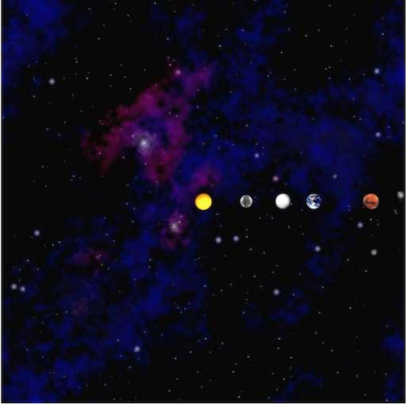

## NBody with Objects

---

### Getting Started

---

#### A. Goals

The purpose of this homework is to get an introduction to objects and object-oriented programming by reworking NBody from HW2. The specific goals are to:

- Learn how to create user-defined data types (classes) in Java.
- Learn to build an object-oriented program incrementally.
- Learn to create and manipulate instances of objects.

This assignment will have the same end goal as HW2. You will implement a program that simulates the motion of the planets. Only now, you'll do it using object oriented design. At the end of this assignment, you will have produced a visual simulation of the gravitational interactions among bodies in two dimensions.

---

#### B. Background

A long time ago in an extraterrestrial body far, far away, you wrote a simulator for celestial physics (i.e. NBody for HW02). You were but a young Padawan, and wrote this with no methods and the entire thing in a single main function. Now, however, you have learned the ways of object-oriented programming and have picked up some sick skills. Skills such as the ability to write functions and now create objects! We will put these skills to use by revisiting our old friend NBody, and giving it an upgrade. We will also witness the benefits of having a modularized program, and how we can use this to easily test our program.

---

#### C. Getting started

Here is a [video](https://drive.google.com/file/d/1k7Xrq2HEg4T86Fa8-GI3gftMWLt4wx7J/view) explaining the Physics background for this assignment. This is the same video as in HW2, so if you need a refresher you can find it here.

You will be provided with two starting skeleton files, `Body.java` and `Space.java`. Add class header comments to each file. These are your starting files for the first two parts of the assignment. You can download the starter files [here](hw05_base/nbody_objects.zip)

Create a Java class called `NBodyObj.java` with an empty `main()` function. Give your file a class header comment.

---

#### D. Advice

Work on the program in the order of the directions. Do not try to do things out of order, as that will likely add to any issues you encounter in the assignment. Much of this assignment is done in "reverse" order of HW2. You will start with physics and work backwards to the drawing and the loop in HW2.

Compile, run, and debug frequently; make one small change at a time, ensuring that your program works as you expect it to after each small change.

Test early and often in main methods. To ensure your code is properly written, you will want (and in fact need) to write your own tests.

Comment frequently and use good variable names as always.

---

### 1. Body.java

---

#### A. Purpose

In this section, you will fill the `Body.java` skeleton file with meaningful code. Note that the words body and planet will be used interchangeably throughout these instructions.

A body can represent a planet, star, or any other celestial body. Each body maintains its own mass (`m`), position (`px`, `py`) and velocity (`vx`, `vy`). Each body also stores its own image file (`img`). Use this information to figure out how to create the constructor.

In addition, a body has methods that can be called to perform various tasks, such as (calculating distance to another object, drawing the body on the canvas, etc.) By implementing these methods, you can recreate the behavior of your celestial bodies in `NBody.java` using object-oriented design.

The skeleton file contains an incomplete stub for every method, with the exception of `toString()`, which is entirely completed for you.

Some notes on the skeleton file:

- Do not remove, rename or change any of the fields (`m, px, py, vx, vy, img`, or `G`)
- As you work, remember to add your own comments and remove the `TODO` tags.
- Try to work on each step in the order presented below.
- Do **not** modify the `toString()` function at all.

---

#### B. Fields

The fields, or attributes, of each body object are provided for you in the skeleton. They are:

```java
double m - mass of the body
double px - the x position of the body
double py - the y position of the body
double vx - the vx position of the body
double vy - the vy position of the body
String img - the filename of the image representing the body
```

These attributes maintain the "state" of the body. Later on in our program, we'll talk about when we manipulate these attributes to simulate motion and gravity. However, for now, just view them as field variables similarly to field variables of other object examples we have covered in class.

*Again, it's important you don't modify these variables.* You will get a style warning (upon submission) saying to make these variables private. Leave these variables public, however, and ignore those style warnings. You will not lose points for these style warnings, but you will lose points if you make these variables private.

---

#### C. Constructor

The Constructor is the method that starts with:

```java
public Body(double mass, double posX, double posY, double velX, double velY, String imageFile);
```

The constructor takes in (via the arguments above) the `mass`, starting position (`posX` and `posY`), starting velocity (`velX` and `velY`), and image filename of the body/planet. Within this constructor, you simply need to assign the arguments to the correct global variables/fields/attributes.

You must complete the constructor before moving on to any other methods. Look at the constructor examples from the first day we covered objects. This will be very helpful to you here.

---

#### D. Methods

##### toString

`String toString();`

This method has been completed for you. Do not change anything. This will be useful later for printing out the state of your bodies for the sake of testing in main and debugging.

##### distanceToX

`double distanceToX(Body other);`

This method gets the distance between the body on which the method is called and the Body passed in as an argument (other) along the X-Axis, or $\Delta x$. Note – as in HW2 you should not be returning the absolute value of the distance. The distance could be negative. The distance should be the location of the other body - the location of the current body.
For example, if we had two body variables, earth and sun, we could get the $\Delta x$ from the earth to the sun relative to $x$ by calling:

`earth.distanceToX(sun);`

See the diagram below for how to calculate this. Note that in the diagram below, the distance from the earth to the sun is positive (going to the right) and the distance from the sun to the earth is negative (going to the left).

##### distanceToY

`double distanceToY(Body other);`

Similarly to the previous method, this method gets the distance between the calling body and the Body passed in as an argument (other) along the Y-Axis, or $\Delta y$. See the diagram above. Again, this result can be negative. For example, the $\Delta y$ from the sun to the earth is negative, since it is downwards.

##### distanceTo

`double distanceTo(Body other);`

This gets the true distance ($d$ in the diagram above), between the bodies via a straight line. See the diagram above for how to calculate this. Remember, when squaring numbers, do not use `Math.pow()`, use simple multiplication. It is much faster.

##### Force

`double force(Body other);`

This function gets the gravitational force between the calling body and the argument body. The overall force is calculated by:

`G * m1 * m2 / (d * d)`

Where:

- `G` is the gravitational constant 6.67e-11 (already declared in the skeleton file)
- `m1` is the mass of the calling planet
- `m2` is the mass of the argument planet
- `d` is the distance between the planets

##### forceX

`double forceX(Body other);`

This function returns the x component of the force (F) between the calling planet and the called planet. This is calculated by:
`Fx = F * dx / d`

Where:

- $F$ is the net gravitational force between the planets
- `dx` is the distance between the planets relative only to the $x$ axis
- `d` is the diagonal distance between the planets

##### forceY

`double forceY(Body other);`

This function returns the y component of the force (F) between the calling planet and the called planet. This is calculated by:

`Fy = F * dy / d`

Where:

- Force is the net gravitational force between the planets
- `dy` is the distance between the planets relative only to the y axis
- `d` is the diagonal distance between the planets


##### Draw

`void draw()`

This function draws the calling body by calling the appropriate PennDraw function with the necessary attributes of the body. This method should contain a single line of code.

##### Move

`void move(double timeStep)`

Update the position of the calling body. For the original values of position: (px, py) the resultant values should be (px + Δt vx, py + Δt vy). Δt, in this formula, represents timeStep. There should be NO LOOP inside this function.

##### getAffectedBy

`void getAffectedBy(Body other, double timeStep)`

This function updates the velocity of the calling body due to the gravitational pull of the argument, other (another body). This function should not alter the velocity of the other body. For the original values of velocity: (vx, vy) you will update the velocities to (vx + Δt ax, vy + Δt ay) for the body which is being affected.

The acceleration is calculated by the force of gravity between the planets. Look back to HW2 to recall the steps required (and order) to update acceleration, and velocity.

**Updating accelerations:** ax can be calculated by fx / m where fx is the x component of the force between the two planets. m is the mass of the calling body. You can calculate ay in a similar way. There should be NO LOOP inside this function.

Note that any updates made here ONLY concern two bodies, the calling body and the body passed in as an argument. There should be no loop in the function. This is different than in HW2. In HW2, you calculated the change in velocity on one planet caused by every other planet at the same time. Here, you will use this function repeatedly to calculate the change in velocity due to every other body one at a time. It may seem strange that we are only calculating the force between two bodies, not one body to every other body. However, ensuring all the bodies interact correctly will be handled in `Space.java`.

---

#### E. Checkpoint

Compile `Body.java` to ensure it compiles with no syntax errors.

---

#### F. Checkpoint

Submit your `Body.java` on Gradescope. There will be a series of individual function tests. Ensure that ALL of the online tests pass BEFORE moving on to Space.java
Note that you will get style warnings for the variables from the skeleton file. You can ignore these warnings below:

```
Body.java:X:XX: Variable 'px' must be private and have get/set methods.
Body.java:X:XX: Variable 'py' must be private and have get/set methods.
Body.java:X:XX: Variable 'vx' must be private and have get/set methods.
Body.java:X:XX: Variable 'vy' must be private and have get/set methods.
Body.java:X:XX: Variable 'm' must be private and have get/set methods.
Body.java:X:XX: Variable 'img' must be private and have get/set methods.
```

All other style warnings must be corrected. The above style warning relates to visibility, which will be discussed in class in the coming week. However, for this assignment, do not make these variables private. You will not lose points for these checkstyle errors, but you will lose points if you make these variables private.

---

### 2. Space.java

#### A. Purpose

Your `Space.java` file will act as the "planet manager". Any Space object you create will maintain an array of planets, and provide means to simulate all the planets’ movements en masse (that is, all at once rather than 1 at a time). Space also maintains the radius of the system we are simulating. Further, `Space.java` is responsible for drawing the starfield background and the planets in the starfield.

Begin by opening the skeleton file for `Space.java`.

---

#### B. Fields

The fields provided in the skeleton are:

- `Body[] bodies` - an array of body objects (the planets) in the universe
- `double radius` - the radius of the universe

These attributes maintain the "state" of the body. Later on in our program, we'll talk about when we manipulate these variables to simulate motion and gravity. However, for now, just view them as field variables similar to field variables of other objects we have covered in class.

Again, it's important you don't modify these variable declarations. You will get a style warning saying to make these variables private. Leave these variables public, however, and ignore those style warnings. You will not lose points for these style warnings, but you will lose points if you make these variables private.

---

#### C. Constructor

The constructor takes in a universe file (a text file containing all the relevant information of the universe we’re simulating). It uses this file to set the value radius variable (one of the fields in our Space class), as well as to initialize and populate the bodies array.
You will be provided with a text file of the following format. (Note the blue text is not in the file, we have it here just to annotate the file.)

```java
5        numBodies
2.50e+11 radius 
5.97400e+24  1.49600e+11  0.00000e+00  0.00000e+00  2.98000e+04    earth.gif
6.41900e+23  2.27900e+11  0.00000e+00  0.00000e+00  2.41000e+04     mars.gif
3.30200e+23  5.79000e+10  0.00000e+00  0.00000e+00  4.79000e+04  mercury.gif
1.98900e+30  0.00000e+00  0.00000e+00  0.00000e+00  0.00000e+00      sun.gif
4.86900e+24  1.08200e+11  0.00000e+00  0.00000e+00  3.50000e+04    venus.gif
m            px           py           vx           vy             img
```

In this file,

- `numBodies` is the number of bodies in the simulation.
- `radius` is the radius of the universe; your simulation will assume that all bodies will have x- and y-coordinates between the values, -radius and radius.

There will be `numBodies` rows of text remaining in the file, each containing six values:

- the mass of the body in kilograms (`m`)
- the initial x- and y-coordinates of the particle in metres (`px`, `py`)
- the initial x- and y-components of the particle velocity in metres per second (`vx`, `vy`)
- the filename of the image file used to represent the particle in the simulation

Remember, unlike in HW2, you will not be storing these values into arrays. Rather, you should use all of the data in each row of the file to instantiate one Body object and then store that object into the bodies array.

Start by opening the file the same as you did in HW2 by creating an In variable to read a file. If you forgot how to do this, you can look at the *Reading From a File* portion of hw2.

From there, you will process the file similarly to HW2. However, instead of storing the data in arrays, like you did in HW2, you will store the data in objects. First, read numBodies. Once you know how many bodies there are, you can create your Body array variable. Your Body array should have size `numBodies`, so initialize that array now.
After that, you can set the Space `radius` variable. Immediately after setting this variable, you can go ahead and call:

```java
PennDraw.setXscale(-radius, radius);
PennDraw.setYscale(-radius, radius);
```

Finally, iterate through the next `numBodies` lines for the input file. For each line, you should create an instance of the Body class and store that instance in the bodies array.

---

#### D. Methods

---

##### toString

`String toString()`

Once again, this method is given too you, do not change it. The output of this method should match the print statement in HW2.

##### simulate

`void simulate(double timeStep)`

In this method, you will simulate the physics of the bodies for a duration of timeStep. You can think of this as similar to the contents of one iteration of your time loop in HW2. In this method, you must first update the velocities of all the bodies. After ALL of the bodies velocities are updated, you must update the positions of the bodies. If you are finding your results are slightly off, you may have the update velocities and update positions either out of order or staggered.

Note that this method has no time loop, that will be handled in the final class you write for this assignment. So you should have no loop that is over a duration of time. You will, however, have multiple loops over the bodies arrays.

##### Updating Velocities

To update the velocities, you will use the `getAffectedBy()` method on each body multiple times. Say for example we were simulating three body variables: earth, sun, and moon. You would need to call:

```java
earth.getAffectedBy(sun, timeStep);    earth.getAffectedBy(moon, timeStep);
sun.getAffectedBy(earth, timeStep);    sun.getAffectedBy(moon, timeStep);
moon.getAffectedBy(sun, timeStep);    moon.getAffectedBy(earth, timeStep);
```

Note that in this class, you don't have body variables. Rather, you have a array storing Body objects. You must have each planet getAffectedBy() every other planet. However, you do not want a planet to affect itself (i.e., the earth's gravity has no effect on the earth itself).

##### Updating Positions

After updating velocities, you should update all planet positions. This can be done by simply calling the `move()` method on each body instance.

##### draw

`void draw()`

First, this method should draw the `starfield.jpg` at the center of the screen. Similar to HW2, this can be accomplished by `PennDraw.picture(0.0, 0.0, "starfield.jpg")`. After drawing the starfield, this method will draw each body. This should be done by calling every individual body's draw method.

#### E. Checkpoint

At this point, you can submit both `Body.java` and `Space.java` to Gradescope. You should ensure all tests are passing.

To test drawing, add a `main()` function to Space.java and add the following two lines of code to it.

```java
Space s = new Space("solarSystem.txt");
s.draw();
```

This should produce the following drawing:



If your drawing does not look like this, try to debug your `draw()` functions. Consider:

- Are you drawing each body's picture correctly in Body.java?
- Are you drawing the bodies on top of the starfield, or the starfield on top of the bodies?

---

### 3. NBodyObj.java

### A. Purpose

This is the "main" class that executes NBody. This is the file you will run to utilize the Space and Body classes to simulate a gravity. this program will take in command line arguments, create the Space object, and then execute the time loop to simulate the movement of the planets. This will also be by far your smallest class in this program.

You were not given a skeleton for this program. However, you will only need one function, and that is your standard main function. All your code should be in main.

---

#### Command Line Arguments

These command line arguments are the same as HW2.

- The first argument is the simulationTime, the total time to simulate the solar system.
- The second argument is the timeStep, the duration of each "step" of the simulation
- The third argument is filename, the name of your universe file.

Utilize these arguments the same way as in HW2. For a command line below should simulate our inner solar system for the duration of one year, run your program with:

```java
java NBodyObj 31557600.0 25000.0 solarSystem.txt
```

---

#### B. Creating the Space Object

You simply need to create an instance of the Space class using the input filename. This should be done after you process the Command Line Arguments, but before the Time Loop.

---

#### C. Time Loop

Similar to HW2, you should have a loop to iterate over the duration of the simulation, starting at elapsedTime = 0 and looping until elapsedTime is no longer less than simulationTime. You should increment elapsedTime by timeStep every time.

Do not forget to use `PennDraw.enableAnimation()`, `PennDraw.advance()`, and `PennDraw.disableAnimation()` in the appropriate places.

Within the body of the time loop, you should simply call the `simulate()` and `draw()` methods on your Space object. Because Space class handles all of the physics simulation, it keeps this loop very simple and short.
After your time loop finishes (that is, after the closing bracket of the loop), for testing purposes, write the following line of code:

```java
System.out.println(nameOfYourSpaceVariable);
```

Replace `nameOfYourSpaceVariable` with the variable name you got from "Creating the Space Object".

This will cause the Space object's `toString()` function to be called. This will print the universe's parameters, including all the details about the planets, AFTER your simulation finishes. This will be useful for comparing the output of your NBodyObj with the expected output in the submission report.

---

#### A. Readme

Complete `readme_nbody2.txt` in the same way that you have done for previous assignments.

#### B. Submission

Submit `Body.java`, `Space.java`, `NBodyObj.java`, and `readme_nbody2.txt` on Gradescope.

Before submission remove any print statements that were used for debugging or testing your functions. The only print statement that shouldn't be removed is the final print statement in `NBodyObj.java`.

Be sure that each class had an appropriate header comment (as in previous assignments). Also ensure that every method has an appropriate header comment, and that your code is well-documented.

If the autograder times out when you submit, you likely have an infinite loop somewhere. You might have <= in place of <, or incorrect incrementing conditions. Check your loops and make sure you test it yourself.

As noted in several places, you will get some style warnings here. You can ignore the following style warnings:

```
Body.java:X:XX: Variable 'px' must be private and have get/set methods.
Body.java:X:XX: Variable 'py' must be private and have get/set methods.
Body.java:X:XX: Variable 'vx' must be private and have get/set methods.
Body.java:X:XX: Variable 'vy' must be private and have get/set methods.
Body.java:X:XX: Variable 'm' must be private and have get/set methods.
Body.java:X:XX: Variable 'img' must be private and have get/set methods.
Space.java:X:XX: Variable 'bodies' must be private and have get/set methods.
Space.java:X:XX: Variable 'radius' must be private and have get/set methods.
```

These style warnings relate to visibility, which will be discussed in class in the coming week. However, as noted in the skeleton, do not edit these variables. Simply leave them as is. However, you must fix all other style warnings.
