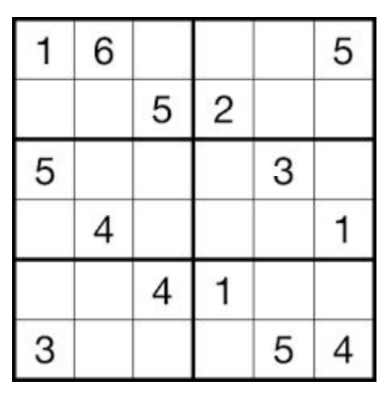
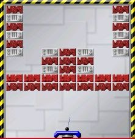
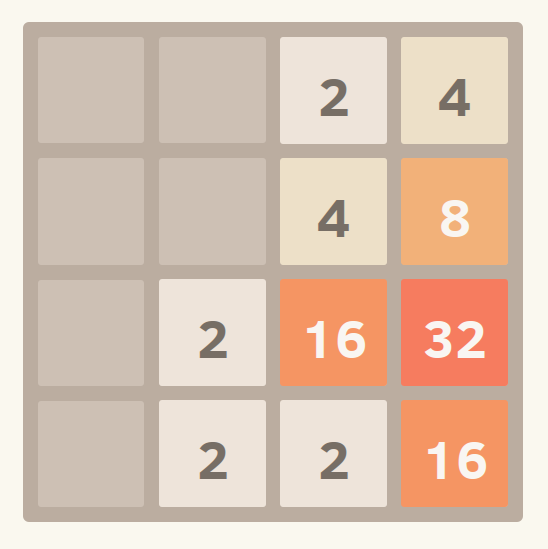
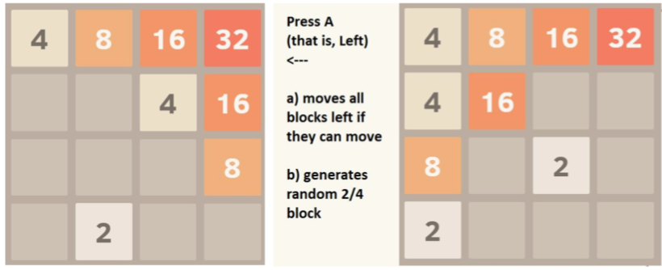
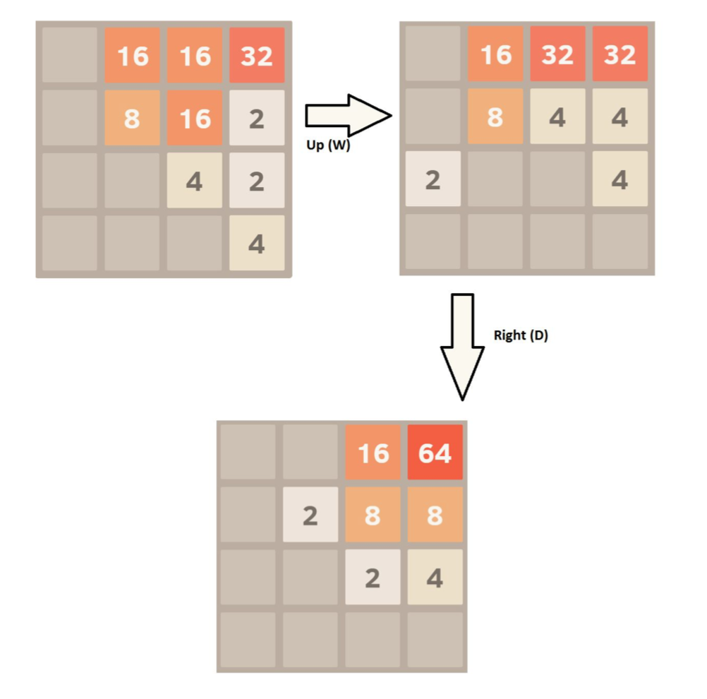
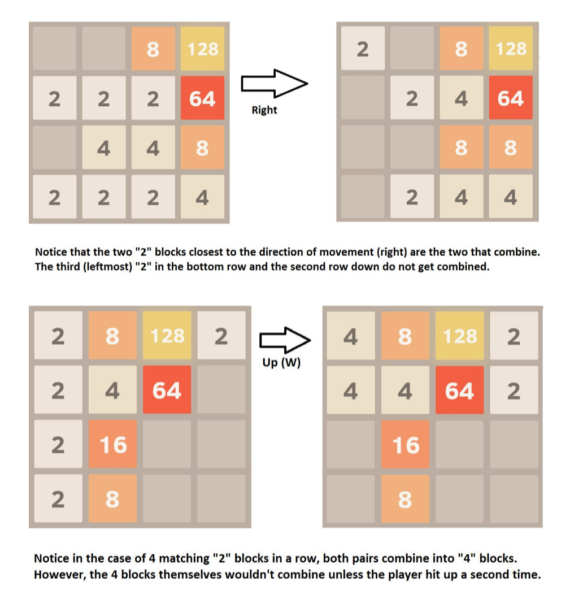
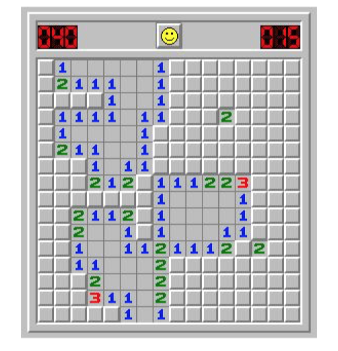
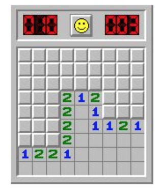
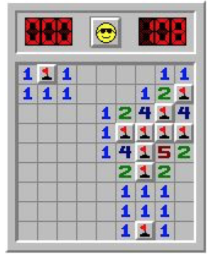

## Project

### A. Goals

This is a closed-ended project that provides you the opportunity to apply everything you have learned in CIS 110 to one of the options below. You will be responsible for choosing one of the four given problems (or coming up with your own), analyzing that problem to determine how to solve it, decomposing the functionality of your program to identify its class structure and the API for each class, and then implementing and testing your program. You will ​not​ be given any skeleton code for this project. You must write your own files and make the best design and data structure choices as you see fit.

You are ​not​ permitted to work with a partner on this project.

Start early and reach out if you have any questions or concerns.

**You may be tempted to use code directly from the internet or use such code as a base template. Please do not do so. We are extremely adept at catching such cases and strict action will be taken.**

---

### B. Project Requirements

In this assignment, you will implement **1** of 4 games below. Your project must use ​object-oriented​ design. If you implement your entire project as static, with no object instances, you will lose significant points. Each project has their own requirements enumerated at the end of their writeup.

---

### C. Project Ideas

You must pick one of these 4 options.
Brickbreaker - implement the game Brickbreaker using mouse or keyboard controls.
2048 - implement 2048 game using keyboard controls.
6x6 Sudoku Solver - Implement an interactive Sudoku game.
Minesweeper - a classic puzzle game where you have to be careful where you click! Implement the beginner difficulty of minesweeper.
Tetris - implement a simplified version of the classic Tetris game with keyboard controls.

---

### D. Designing the Game

We encourage you to spend time thinking out the design of your game before you begin programming it. A well-thought out design would include a list of classes, the functionality corresponding to each class, the fields and methods contained in each class, and the functionality corresponding to each method.

If you spend the time creating a design, we encourage you to stop by office hours and talk over your design with a TA before you begin coding. If you choose to do this, you are welcome to use the conceptual queue to discuss your design.

---
 
### Sudoku

In this project, you will implement an interactive 6x6 Sudoku game. ​You can practice solving strategies by playing [here](https://sudoku.com/).
Sudoku​ is a puzzle where a player must fill an ​n​x​n​ (typically 9) grid with numbers 1-​n​ such that no single number appears twice in any row, column, or grid box. Typically, Sudoku puzzles are written such that they have 1 and only 1 solution. This means most Sudoku's can be solved by deductive reasoning.

The input sudoku table will be passed as a text file. For example, [​this text file​](hw09_base/sudokuExample.txt) represents the Sudoku puzzle below.
This file should be passed in via ​command line arguments​. Each digit is used for a square that is filled in at the start, while a whitespace character ​' '​ is used for an empty square. Your program should produce a meaningful error message if the input is incorrectly formatted (such as not 6x6 characters, using characters besides whitespace and digits 1-6, or an illegal grid, such as two 4s in the same row as a starting point.)

Note that in 6x6 Sudoku, the grid boxes are all 2 rows by 3 columns. A single digit cannot appear twice in a bolded box.
Your program will be an interactive sudoku game with meaningful visual interactions and involve both the mouse and keyboard. It cannot simply be text based through the command line.

Players must be able to choose which square they want to provide input for and then be able to type in a number to put in that square.

---

#### Additional Requirements

If a player inputs a value which directly violates a rule (for example, there was already a 1 in the row and the player input another 1 in the same row), you should mark the contradictory values in red and highlight the region of the board causing an issue. For example, if there’s a conflict in the second row, you should highlight the second row and mark the problem values in red. If there’s a contradiction in both a row and a column, you should highlight both the row and the column, etc.
When a player has filled in all the squares correctly, you should provide a “win” message.

---

### Brickbreaker

In this project, you will implement the game, Brickbreaker. ​If you need a refresher or introduction to the game, you can play [here.](https://www.puzzleplayground.com/g/brick-breaker)

Brickbreaker is a game in which a ball is initially launched from a platform and collides with bricks in the upper region of the game board. When the bricks have been hit a certain amount of times, they lose their strength completely, and disappear. The game (or a certain level) is complete when the ball knocks out all of the bricks. The game is lost when the ball falls to the ground (off-screen), missing the platform enough times that it no longer has any lives/attempts left.

---

#### Requirements

- The game must have a restart feature such that when the player has no more lives, the screen redirects to a page that requires user input to restart the game as if the program were run for the first time.
- Each time the ball misses the platform or if the game is being played for the first time, the game must begin with the ball stationary on the platform and require player input before the ball is allowed to begin movement again.
- The platform must only move in the x-direction.
- There must be at least three kinds of bricks with varying strengths and their strength should be differentiated with some visual cue.
	- Each of the three kinds could be a different color
	- Or you could display a number on each brick, representing its strength
- In addition, when a brick loses strength after a collision, there should be some visual cue to indicate that it was hit by the ball.
- The ball must bounce off the top, left, and right boundaries.
- The ball must move with some velocity in the x-direction and y-direction as well as an acceleration.
- The acceleration should change in different way when it collides with a brick compared to when it collides with the platform.
- If the player eliminates all of the bricks, the game should stop, a victory message should be displayed in text on the screen, and the player should have the option to start a new game.
- It is up to you how complex or simple to to make this movement, but at a minimum the acceleration should be affected in some unique way in the two cases described above.

---

### 2048

For this option you will be implementing the highly addictive 2048 game. [Here is a description](https://en.wikipedia.org/wiki/2048_(video_game)) of the game.

The best way to understand the game is to play it yourself. You can find an online version [​here​](https://play2048.co/).

Your game should have a 4x4 grid. Using WASD controls (W is up, A is left, D is right, S is down). Pressing in a direction moves all blocks in that direction. Example:

Like numbers can be "combined". That is, if two numbers "crash" into each other, they combine to be the sum of the two numbers. For example, two "2" blocks would combine to be a "4", and two "4" blocks would combine to be an "8". Example:

There are two special cases worth considering, 3 elements in a row or column and four in a row or column. Example of 3 in a row:

---

#### Requirements

- The user's screen should be a 4x4 grid. Each square on the grid either contains a number tile or not.
- You are not required to match any aesthetic style. I.e., the number colors are not required. However, the numbers should be visible within each cell, and should be easily legible.
- The user presses one of four keys - w, s, a, d which represent the directions up, down, left, right. All the current tiles on the board shift to the direction specified by the user's key press. If a number tile "crashes" into another tile with the same number - then they merge to form a single tile with twice the value.
- During every turn, a new number tile consisting of 2 or 4 should enter the board. The tile must enter at any random, unoccupied position on the board. 
- If the grid is full of number tiles and there is no move possible for the user then the game is over. If the user has managed to bring a 2048 tile onto the board (by merging 2 1048 tiles) then the user wins.
- Do not end the game if there are possible moves, even if the board is full!
- The game should keep track of the number of moves made by the user and output this in the victory/defeat message.

---

#### Additional Challenge (not extra credit, just a fun way to challenge yourself)

- You are not required to show the animation (that is, the blocks sliding). However, as enrichment, it can be a fun challenge to add that.
- Try adding the color gradient shown above, where each number has a unique color.
- Try writing a version of the game that plays itself, using some AI to play as optimally as possible. If your AI can routinely get 2048, let us know!

---

### Minesweeper

Minesweeper is a classic puzzle game (​[which can be played here​](http://minesweeperonline.com/#)).

In the game, a single player tries to sweep a minefield to clear out every space that isn't a mine. Each space is either ​blank​,a​ numberspace,​ or a ​mine. ​The contents of each space are initially hidden. By clicking on a space, you reveal its contents.

A mine ​is a square that if you click on, you lose the game. You can avoid clicking on mine squares by using the hints provided by ​number spaces​.

A number space​ indicates that there is a mine either left, right, up, down, or diagonal of a mine. Clicking on a number square reveals that square and that square only. Example, a 1 means there is 1 mine nearby. The maximum possible digit is 8, which would mean all 8 squares around the space are mines.

A blank space​ is like a numbered square where the number is zero. That is, there are no mines in any of the adjacent 8 spaces. If you click on a blank space, it reveals both itself and all adjacent squares. If any of the adjacent squares are blank, it should further reveal all adjacents squares. For example, in the below game, when I click on the bottom right corner, I got about a third of the board shown: 

The player wins the game if they click on every space that isn't a mine. However, if the player clicks on a single square that is a mine, the player loses the game.
Below is an example of a completed minesweeper game:

---

### Requirements

- The game must be implemented in `PennDraw`.
- The board must be 9x9 (That is, the same as beginner difficulty).
- There must be exactly 10 mines
  - The mines must be placed randomly, they should be in a different place each game
  - The mines should not be visible until a player clicks on one (at which point the player loses the game).
  - The first square a player picks must never be a mine. The easiest way to handle this is to generate the location of the mines after the player clicks the first square.
- You must generate the numbered squares and blank spaces correctly. That is, if I click on a numbered square and see a "2", there should be exactly 2 mines touching that square.
- If a player reveals a space that isn't a mine or adjacent to a mine, it should reveal itself and all adjacent non-mine spaces. Each adjacent space should also reveal itself all adjacent non-mine spaces, and this should continue outwards.
- If a player reveals every space that isn't a mine, the game should end and the player should get a message saying they won
- If a player reveals a mine, they game should end and the player should get a message saying they lost
- You may use any aesthetic style you like (you are not required to match the windows aesthetic). However, the following must be true:
  - The game must be 9x9 grid
  - There should be a visible difference between an ​unrevealed​ square and a revealed square
- `PennDraw` does ​not​ support right clicking, so you do not need to implement the flag mechanic. Similarly, the "middle clicking" tool many minesweeper players use will also not be possible to implement in `PennDraw`.
- The game must be replayable after a game over (either win or loss) without rerunning the program. The board should be reset - you cannot use the same board as the last game.

---

### Additional Challenge (not extra credit, just a fun way to challenge yourself)

In minesweeper, it is valuable to be able to "mark" spaces you know aren't safe. This is done typically using a flag. In most variations of the game, this is done by right clicking with the mouse. However, `PennDraw` does NOT support right clicking. Try to implement another way to use flagging in the game. This could include things like:

- Have a button on the screen that toggles to "flagging" mode. While in flagging mode, clicking on a square does NOT reveal it. It does mark it with a flag, however. This button would switch the user between "flagging" mode and "revealing" (that is, click reveals the tile) mode.
- Have it where if a user clicks while holding space bar, or control, or some other button, instead of revealing, it flags the tile. This approach may be a bit more intuitive to play with, but is harder to implement.
- Implement a menu with multiple difficulties.
- Implement visual effects to make it look cooler.

---

### Tetris

Tetris is a classic video game that can be played [here](https://tetris.com/play-tetris).

In the game, various shapes (shown below) begin to fall from the top of the screen, and the player uses keyboard controls to control where the piece falls. When the player fills a row, all items in that row disappear and the above items shift down. The game is lost if any of the pieces reach the top of the board. 

In the traditional version of the game, the player uses keyboard controls to move the piece side-to-side, rotate the piece, and control the dropping speed. For this version of the game, you are only required to implement side-to-side movement and "hard drop". A hard drop should instantly place the piece where it would have ended up, without showing the animation as it falls.

---

#### Requirements
- The game must be implemented in `PennDraw`.
- The game should show a start page, and take some input (either a click or key press) to start the game.
- The game should keep track of score, and display it somewhere on the screen as the game is going on. The score should start at 0.
- Each piece should start at the top and drop at a consistent rate until it collides with another piece or reaches the bottom.
- The pieces falling should be randomly chosen out of at least two options. You must include the yellow and blue pieces from above, but are welcome to add more pieces as you choose.
- Pressing the key j while the piece is falling should move the piece one unit to the left as it falls.
- Pressing the key l while the piece is falling should move the piece one unit to the right as it falls. 
- Pressing the key k while the piece is falling should execute a hard drop, where the piece goes instantly to its location at the bottom.
- It must be possible to fill a row with the pieces you choose to include in the game. When a row becomes full, that row should clear and everything resting on top of it should shift down one row.
- When you clear one row, the score should increase by 40 pts. Clearing 2 rows at once should increase the score by 100 pts, clearing 3 at once should increase the score by 300 pts, and clearing 4 rows at once should increase the score by 1200 pts.
- If the player allows any piece to hit the top of the board, they should lose the game.
- The game must have a restart feature such that when the player loses, the screen indicates the loss in some way and redirects to the start page as if the program were run for the first time. The loss indication must be clearly visible to the player.

---

#### Additional Challenge (not extra credit, just a fun way to challenge yourself)

- Implement more pieces than the required two pieces.
- Implement rotation! The key u could rotate 90 degrees to the left, and the key o could rotate 90 degrees to the right.
- Implement a "soft drop," such that clicking a certain key increases the dropping speed but still shows the animation. 

---

## Submission

Submissions will be through Gradescope. Any Java source files you submit will be tested for compilation and style. Make sure to submit every file necessary for running your program.

Important: You must write your own README text file and submit it with everything else. Structure it however you wish, but it must contain the following information:

- Instructions for how to run your program (which class to run, any command line arguments)
- Any additional features you added beyond the assignment specifications
- A brief description of each file and its purpose
