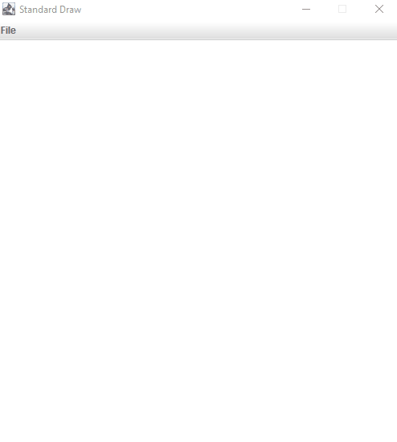
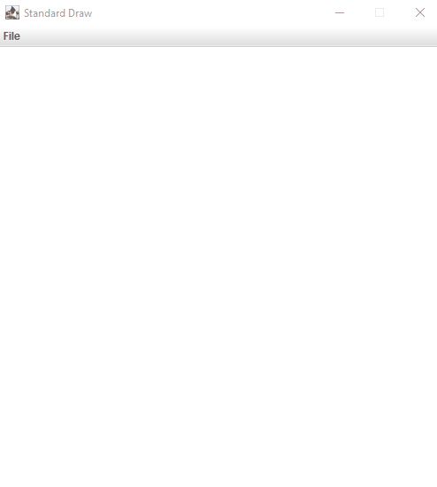

## Rivalry

---

### 1. Getting Started

#### Goals

The general goal of this assignment is to write three Java programs which make use of loops, and conditionals. The specific goals are to:

- Learn more about `PennDraw`
  - Animation
  - Mouse input
- Learn to declare, assign, and operate on variables
- Learn about loops and conditionals
- Learn how to use `Math.random()` to simulate random behavior

All the necessary files for this assignment can be found on Codio, but if you'd like to download them separately they can be found [here](hw01_base/base.zip).

#### Background

This assignment is split in three parts. In the first part, you will write a program that responds to user key input; in the second, you will write a program that responds to the user's clicks on a canvas; in the third, you will write a simple animation.

---

### 2. LetterViewer
Write a program that displays the most recently pressed key in the center of the screen. You can find the starter file in your Codio, called `LetterViewer.java`, or you can download it [here](hw01_base/LetterViewer.java).

The canvas should be blank until the first key is pressed. Then, the most recent character pressed should remain on the screen until the next character is pressed. 

Some notes:
- Your canvas should be sized 500x500
- The font size should be 64 point and the font color should be black.
- Pressing Spacebar or Return will effectively clear the screen. It's OK if non-alphanumeric characters respond strangely.

---

### 3. LineDrawingTool
Write a program that connects lines between the last place the mouse was clicked and the most recent place the mouse was clicked. You can find the started file in your Codio, called `LineDrawingTool.java`, or you can download it [here](hw01_base/LineDrawingTool.java).

The canvas will be blank until the first mouse click. The first line should be drawn from the center of the screen to the most recent mouse click. If the mouse is clicked in the top half of the screen, draw the line in red. If the mouse is clicked in the bottom half of the screen, draw the line in black.

Some notes:
- Your canvas should be sized 500x500
- The pen radius should be set to `0.01`.
- It doesn't matter what color the line is if you manage to click precisely in the middle of the screen.
- Don't worry about the behavior when the user clicks and drags the mouse. Assume that the user will click without holding down the mouse button.

---

### 4. Rivalry

#### Help Resources

- [Homework Help Video](https://youtu.be/iciILUpYk9w)
  - Note that in this video, we say the percentage chances of moving are 51% and 49% for part 1. This is changed this semester to be 52% and 48%. Otherwise, the assignments are the same.

#### Program Overview

You will write a program `Rivalry.java` that visualizes a race between two contestants. Do not set up the program yet. Read through all of this portion of the assignment first so you have an understanding of the big picture before you start setting up. Once you read the following description, you can use the skeleton code provided below to start coding the program.

As you are well aware, Princeton is one of Penn's main rivals. So for the example race, we used an image of the Penn pennant and an image of the Princeton pennant as the two racing rivals. In your program, you will choose two images that represent your own favorite pair of rivals. For example, you may want to use images of Nicki Minaj and Cardi B or Apple Music and Spotify. Once you choose your images, download them as png files and **upload them to Codio** (File -> Upload).

Here is an example of what the race will look like. Since the movement of the pennants is randomly controlled, the final state of the pennants in the image below is just an example; the result will be different each time the program is run.

---

#### Program Setup

On Codio, open the Rivalry assignment. You should see the file you will write for this portion of the assignment, `Rivalry.java`, as well as the `readme` for the assignment, which you will complete at the end.

The skeleton code for `Rivalry.java` has the word `TODO` in places where we want you to fill things in. Once you complete the `TODOs`, you should **delete these comments and add your own comments** to describe the functionality of your code. You will see the use of `enableAnimation()`, `disableAnimation()`, and `advance()` in the skeleton code. Read the animation section of the [PennDraw wiki](../resources/penndraw.html) for an explanation of these functions to understand why we use them.

Use the specifications from below, along with the skeleton code, to create the race between your rivals. Always write code in small steps. Compile and test after each step. Do not move on to another task in the program until you are sure your current code is working.

---

#### Rivalry Specifications

**Your program must follow the specifications below:**

- It should have the default window size, 512 x 512 pixels. Do not use `PennDraw.setCanvasSize()`, `PennDraw.setXScale()`, `PennDraw.setYScale()`, or `PennDraw.setScale()`.
- It should have a start and finish line, drawn far enough from the window edges so that your rival images can start completely behind the start line and are clearly visible (fully within the window bounds) even when the race has ended. The thickness and color of the start and finish lines are up to you.
- Your two images should be **no larger than 150 x 150 pixels**. Once you choose your images, you can alter their size using the `PennDraw.picture(xcenter, ycenter, filename, width, height)` function. Changing the values of width and height will alter the dimensions with which the image appears on the canvas. It will not alter the actual size of the image saved on your computer.
  - Note: If you know how to manually resize images on your computer, you are welcome to do that as well.
- The two rivals should start completely to the left of the starting line on the left. To draw an image, you will use `PennDraw.picture(x, y, filename)` (if you do not need to change the size of your image) or `PennDraw.picture(xcenter, ycenter, filename, width, height)` (if you need to draw the image at a size different than its native state). You will replace `x` and `y`, with the desired `x` and `y` coordinates of the center of the image. The filename will be replaced with the exact name of the image file as it appears in your homework folder.
- Within each loop iteration, each image should move one pixel towards the finish line on the right with a random probability. One of the rivals will naturally be stronger in your expert opinion so they should have a slight advantage of moving forward in the race. The stronger rival will move with a probability of **0.52** (that is 52%). By contrast, the weaker rival moves (independently of whether the other contestant moves) with a probability of **0.48** (that is, 48%).
  - **Hint: Use these probabilities along with the Math.random() function (which produces a double value between 0.0 inclusive and 1.0 exclusive) to determine when each image should move forward in the race.**
  - What we mean by moving independently: It should be possible, in any given frame of the animation, for
    - a) the stronger contestant to move, but the weaker contestant to not move.
    - b) the weaker contestant to move, but the stronger contestant not to move.
    - c) Both to move.
    - d) Neither to move.
- To keep the animation simple, we will say that a contestant wins the moment the center of the image has crossed the finish line on the right side of the screen before the center of the other image has.
- As soon as one of the contestants wins, the animation should stop, and your program should draw text on the canvas indicating which contestant won. The position and format of the text is up to you. (You do not need to print text to the console)
- **Do not** use the `break` keyword to exit the loop.
- In the case of a tie, the stronger contestant is declared the winner.
- You are welcome to make the background as fancy or as simple as you'd like. Your race does not need to look exactly like the sample shown above.
- Remember, the [PennDraw wiki](../resources/penndraw.html) will be helpful.

---

### Readme

`readme_rivalry.txt` is included in Codio. Open it in Codio, and answer the questions.

---

### Extra Credit

Implement `Rivalry.java` by custom drawing your rivals with `PennDraw` functions instead of using picture files!
Your rival drawings must make use of at least five (not necessarily different) `PennDraw` function calls to be counted for credit.

---

### Submission

Submit your homework under HW01 on [Gradescope](https://www.gradescope.com/courses/149937). You need to upload `Rivalry.java`, `LetterViewer.java`, `LineDrawingTool.java`, `readme_rivalry.txt`, and any and all images you used in Rivalry.

**All program file names should match the required names exactly, including capitalization. Make sure you submit the .java files, NOT the .class files.** 

Again, you must submit **all image files** you used in your programs exactly with the exact file names as they appear saved in your HW01 folder.
