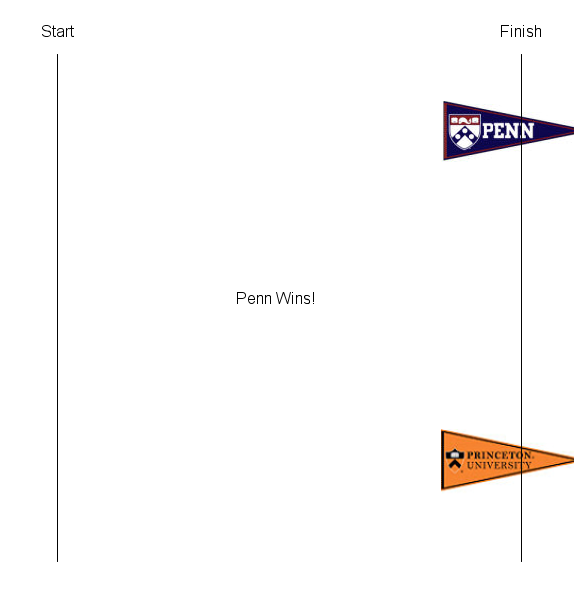

## Rivalry and Click Art

---

### 1. Getting Started

#### Goals

The general goal of the Canvas Creations assignment is to write two Java programs which make use of loops, and conditionals. The specific goals are to:

- Learn more about `PennDraw`
  - Animation
  - Mouse input
- Learn to declare, assign, and operate on variables
- Learn about loops and conditionals
- Learn how to use `Math.random()` to simulate random behavior

#### Background

This assignment is split in two parts. In the first part, you will write a simple animation; in the second, you will write a program that responds to the user's clicks on a canvas.

#### Help Resources

- [Homework Help Video](https://youtu.be/iciILUpYk9w)
  - Note that in this video, we say the percentage chances of moving are 51% and 49% for part 1. This is changed this semester to be 53% and 47%. Otherwise, the assignments are the same.

- [Keyboard Controls Program](../assets/example_programs/KeyPrinter.java)
  - Further, in the ClickArt portion, you will need to add keyboard controls. The linked program will print the character of the key pressed to the terminal. You can use this example code to help you learn how to use `PennDraw.hasNextKeyTyped()` and `PennDraw.nextKeyTyped()`.

---

### 2. Rivalry

#### Program Overview

You will write a program Rivalry.java that visualizes a race between two contestants. Do not set up the program yet. Read through all of this portion of the assignment first so you have an understanding of the big picture before you start setting up. Once you read the following description, you can use the skeleton code provided below to start coding the program.

As you are well aware, Princeton is one of Penn's main rivals. So for the example race, we used an image of the Penn pennant and an image of the Princeton pennant as the two racing rivals. In your program, you will choose two images that represent your own favorite pair of rivals. For example, you may want to use images of Nicki Minaj and Cardi B or Apple Music and Spotify. Once you choose your images, download them as png files and **upload them to Codio** (File -> Upload).

Here is an example of what the race will look like. Since the movement of the pennants is randomly controlled, the final state of the pennants in the image below is just an example; the result will be different each time the program is run.

---

#### Program Setup

On Codio, open the Rivalry and ClickArt assignment. You should see the two files you will write for this assignment, `Rivalry.java` and `ClickArt.java`, as well as the `readme` for the assignment, which you will complete at the end.

The skeleton code for `Rivalry.java` has the word `TODO` in places where we want you to fill things in. Once you complete the `TODOs`, you should **delete these comments and add your own comments** to describe the functionality of your code. You will see the use of `enableAnimation()`, `disableAnimation()`, and `advance()` in the skeleton code. Read the animation section of the [PennDraw wiki](../resources/penndraw.html) for an explanation of these functions to understand why we use them.

Use the specifications from below, along with the skeleton code, to create the race between your rivals. Always write code in small steps. Compile and test after each step. Do not move on to another task in the program until you are sure your current code is working.

---

#### Rivalry Specifications

**Your program must follow the specifications below:**

- It should have the default window size, 512 x 512 pixels. Do not use `PennDraw.setCanvasSize()`, `PennDraw.setXScale()`, `PennDraw.setYScale()`, or `PennDraw.setScale()`.
- It should have a start and finish line, drawn far enough from the window edges so that your rival images can start completely behind the start line and are clearly visible (fully within the window bounds) even when the race has ended. The thickness and color of the start and finish lines are up to you.
- Your two images should be **no larger than 150 x 150 pixels**. Once you choose your images, you can alter their size using the `PennDraw.picture(xcenter, ycenter, filename, width, height)` function. Changing the values of width and height will alter the dimensions with which the image appears on the canvas. It will not alter the actual size of the image saved on your computer.
  - Note: If you know how to manually resize images on your computer, you are welcome to do that as well.
- The two rivals should start completely to the left of the starting line on the left. To draw an image, you will use `PennDraw.picture(x, y, filename)` (if you do not need to change the size of your image) or `PennDraw.picture(xcenter, ycenter, filename, width, height)` (if you need to draw the image at a size different than its native state). You will replace `x` and `y`, with the desired `x` and `y` coordinates of the center of the image. The filename will be replaced with the exact name of the image file as it appears in your homework folder.
- Within each loop iteration, each image should move one pixel towards the finish line on the right with a random probability. One of the rivals will naturally be stronger in your expert opinion so they should have a slight advantage of moving forward in the race. The stronger rival will move with a probability of **0.53** (that is 53%). By contrast, the weaker rival moves (independently of whether the other contestant moves) with a probability of **0.47** (that is, 47%).
  - **Hint: Use these probabilities along with the Math.random() function (which produces a double value between 0.0 inclusive and 1.0 exclusive) to determine when each image should move forward in the race.**
  - What we mean by moving independently: It should be possible, in any given frame of the animation, for
    - a) the stronger contestant to move, but the weaker contestant to not move.
    - b) the weaker contestant to move, but the stronger contestant not to move.
    - c) Both to move.
    - d) Neither to move.
- To keep the animation simple, we will say that a contestant wins the moment the center of the image has crossed the finish line on the right side of the screen before the center of the other image has.
- As soon as one of the contestants wins, the animation should stop, and your program should draw text on the canvas indicating which contestant won. The position and format of the text is up to you. (You do not need to print text to the console)
- **Do not** use the `break` keyword to exit the loop.
- In the case of a tie, the stronger contestant is declared the winner.
- You are welcome to make the background as fancy or as simple as you'd like. Your race does not need to look exactly like the sample shown above.
- Remember, the [PennDraw wiki](../resources/penndraw.html) will be helpful.

---

### 3. ClickArt

Write a program `ClickArt.java`, with the following specifications. Read all of this section beginning the coding process.

---

#### ClickArt Specifications

**Your program must follow the specifications below:**

- It should use the default window size of 512 x 512 pixels. Do not call `PennDraw.setCanvasSize()`.
- It should have a background that has a horizon line separating two regions. For example, your background could have a blue sky over green grass, or a blue sky over an ocean of waves.
- The background should be drawn when the program is run (it should not require any user input to appear the first time).
- Some aspect of the background should be generated using both randomness and iteration (`for` or `while` loops). For example, you might draw a nighttime sky filled with randomly colored and sized stars, a green field with randomly placed and sized blades of grass, or a tessellated background with random colors. (You will again find `Math.random()` helpful). You can have the random background in either the top, bottom, or both. However, if you generated a random element in both the top and bottom, these two elements need to be different.
- Your use of `for` or `while` loops can be as simple or as complex as you wish. Your program must simply use one or more loops to draw the background.
- Each time the user presses any key on the keyboard, the program should erase whatever is displayed and draw a new randomly generated background. **The random aspect(s) of the background should be re-generated with each subsequent keypress.** Use the function `PennDraw.hasNextKeyTyped()` to see if the user has pressed a key, and `PennDraw.nextKeyTyped()` to retrieve that actual character typed. You do not need to use this character, but you still must call `nextKeyTyped()` for the code to work correctly. `PennDraw.hasNextKeyTyped()` will be `true` after a key has been pressed until `PennDraw.nextKeyTyped()` is called. Make sure you understand the difference between these two functions and why we must use both of them to utilize keypresses.
- As the user clicks on the sketch, your program should draw an object at that location. You should be changing the size of this object based on its location relative to the horizon line: the size should be smallest at the horizon line, and should increase as the mouse moves farther away from the horizon line (above and below). For example, the size of a house could decrease as the user clicks closer to the center of the sketch, or a smiley face's eyes could enlarge.
- The object sizes should scale smoothly. That is, you cannot use conditionals to check how far the mouse is from the horizon line. (You, of course, should use a conditional to decide which side of the horizon you are on, top or bottom, but you should not have multiple conditionals to determine the size of the object drawn).
- After several mouse clicks, your sketch should have multiple copies of the object at different locations on the screen, each varying slightly based on the mouse position.
- When the user clicks, there must be one type of object in the top region (e.g., the sky) and a different object on the bottom region (e.g., the grass). For example, your program could draw clouds in the sky and flowers in the grass. You could draw multiple different types of objects or characters in the sky, perhaps randomly chosen. Be creatively as you’d like once you’ve met the basic requirements outlined above.
- Feel free to use colors outside of those provided by `PennDraw` (e.g. `PennDraw.RED`); take a look at [this color picker](https://www.google.com/search?q=rgb+color+picker) courtesy of Google and visit the [PennDraw wiki](../resources/penndraw.html) to see how to change the pen color to an RGB value.
- Feel free to use images in your background or as your object, but pay attention to the instructions for submitting them in the submission section.
- **Remember: Somewhere within your sketch, you must use each of the following: variables, conditional if or if-else statements, and for or while loop iteration.**

---

#### ClickArt Setup

To help you get started, `ClickArt.java`'s skeleton code is included in Codio. Again, the `TODO` annotations are where we expect you to fill in your code. Once you complete the `TODO`s, delete the `TODO` comments. The non-commented code can be used as is.

---

### Readme

`readme_rivalry.txt` is included in Codio. Open it in Codio, and answer the questions.

---

### Extra Credit

Implement `Rivalry.java` by custom drawing your rivals with `PennDraw` functions instead of using picture files!
Your rival drawings must make use of at least five (not necessarily different) `PennDraw` function calls to be counted for credit.

---

### Submission

Submit your homework under HW01 on [Gradescope](https://www.gradescope.com/courses/149937). You need to upload `Rivalry.java`, `ClickArt.java`, `readme_rivalry.txt`, and any and all images you used in either program.

**All program file names should match the required names exactly, including capitalization. Make sure you submit the .java files, NOT the .class files, and, if they're being generated, NOT the .java~ files.** If you don't see .java~ files being in your directory, don't worry about this.

Again, you must submit **all image files** you used in your programs exactly with the exact file names as they appear saved in your HW01 folder.
