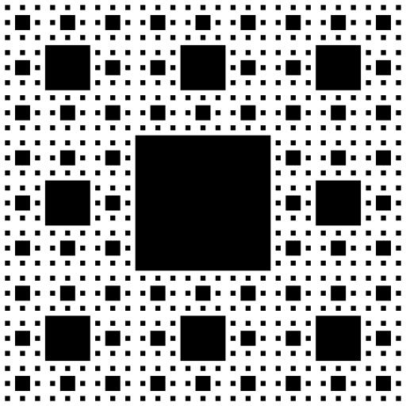
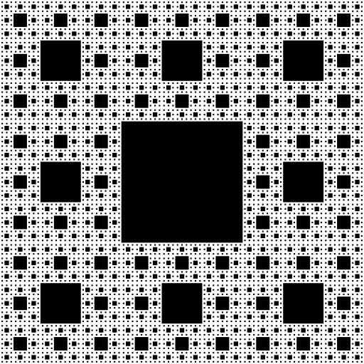
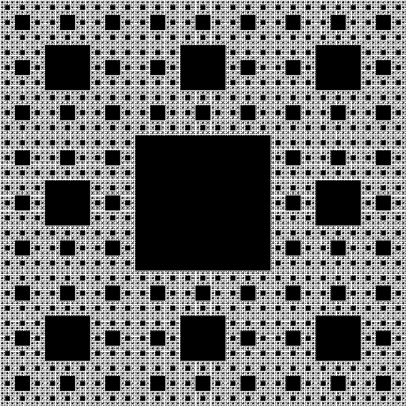

## Part One: Recursive Exercises

---

### Motivation

Recursion is one of the most powerful tools in computer science. It takes a problem that may be very difficult to solve all at once and lets us solve just one part of it. Then we recursively use that logic on the rest of the problem. In the end, we have solved the greater problem just by doing a little bit of work at each step. Recursion can be used to solve enormous problems with just a few lines of code. In fact, there exist problems that can feasibly *only* be solved recursively!
Recursion plays a major role in not just problem solving, but data structures too, which we will see later in the course. Although it’s conceptually difficult, recursion is an incredibly cool and rewarding to learn.

### Applications to Other Fields

Recursion doesn’t exist only in computer science. Other fields, like math, linguistics, and logic, all use recursion. In linguistics, for example, we can build sentences out of phrases, and these phrases can contain themselves as subphrases. For example, we can have a phrase of "big friendly giant", which consists of an adjective, "big", and a subphrase of "friendly giant", which consists of an adjective, being "friendly", and a subphrase, being "giant". This fact means that we can make sentences that are infinitely long - all we have to do is add another level of recursion to our phrases!

---

### Goals

The purpose of this assignment is to gain practice with recursion. The specific goals are to:

- Complete a set of recursion exercises
- Practice writing recursive functions (and helper functions)
- Use recursion to draw a cool fractal system (Sierpinski carpet) (optional)

---

### Setting Up

In the **Recursion Finger Exercise** portion of this assignment, you will create a class of functions that each perform a different task in a recursive fashion. *Solutions using iteration (for/while loops) will be given no credit*. You are responsible for writing proper header comments for the class and for all the functions you will write.

You will be able to test your functions using the autograder on Gradescope, but you should absolutely write tests yourself in `main()` to go over various inputs, as the tests we will show on gradescope are not comprehensive nor representative of our complete testing suite.

You should create two (initially empty) java files in Codio - `FingerExercises.java` and, if you want to do the optional ungraded portion of the assignment, `Sierpinski.java`.

---

### Finger Exercises

For the exercises below, we have provided the method header and problem description. You may find it necessary to write **helper methods** for these methods if you think you need more input parameters than the provided public methods have.

**Important:** Note that, although there are 7 problems outlined, you only need to choose 5 of them to implement. If you implement more than 5, we will grade the first 5 functions in `FingerExercises.java` only. Any additional functions will automatically fail the autograder - if you'd like to see the tests for later functions, comment out the first ones you did.

Here's an example of a problem that doesn't use a helper method. In the code below, `String.substring(x,y)` is inclusive for x and exclusive for y.

```java
public static boolean isPalindrome(String word) {

    // base case - length is 0 or 1, and therefore is a palindrome.
    if (word.length() <= 1) {
        return true;
    }

    // check if first and last are the same
    char firstChar = word.charAt(0);
    char lastChar = word.charAt(word.length() - 1);
    boolean firstAndLastMatch = firstChar == lastChar;

    // if they match, recurse on the string without the first and last letters
    return firstAndLastMatch && isPalindrome(word.substring(1, word.length() - 1));
}
```

We of course could have solved this with a helper like this:

```java
public static boolean isPalindrome(String word) {

    // return our recursive helper since we want another parameter
    return isPalindromeHelper(0, word);
}

public static boolean isPalindromeHelper(int index, String word) {

    // base case is we are halfway through the word and it's still a palindrome
    if (index >= word.length() / 2) {
        return true;
    }

    char firstChar = word.charAt(index);
    char lastChar = word.charAt(word.length() - 1 - index);
    boolean firstAndLastMatch = firstChar == lastChar;

    // recurse on rest if they match - otherwise, we will return false
    return firstAndLastMatch && isPalindromeHelper(index + 1, word);
}
```

Both solutions are equally valid - if you want to solve a problem using a helper method, you will not be penalized for doing so if there exists an implementation without the helper. You should approach these problems in the way that makes the most sense to you.

**Tip:** Remember to start by thinking about the base case — the smallest, simplest problem possible. From there, work out a way to get from a larger input down to the base case.

---

#### 1. Greatest Common Denominator (GCD)

**Method Header:** `public static int gcd(int a, int b)`

**Problem Description:** The Greatest Common Denominator (GCD) of two integers, $a$ and $b$, is the largest number that divides both values. One way to solve this problem is to find the prime factorization of both $a$ and $b$ and return the product of the common factors. That way takes a long time, and we can do it smarter! Euclid came up with an algorithm for this problem long before computer science existed.

1. If $a < b$, return $GCD(b,a)$
2. If $a = b$, return $b$
3. If $b = 0$ return $a$.
4. Otherwise, return $GCD(b, a \% b)$

**Algorithm Explanation**: One way to do GCD would be to start at 1 and keep track of the largest number that divides both values at each level. When we do that, we definitely get the right answer. Another way to think about it is subtracting by the smaller value until the bigger number is less than or equal to the smaller number. For example, say we have 40 and 12. 40 - 12 is 28, 28 - 12 is 16, 16 - 12 is 4, so the answer is 4. This process is very similar to take a modulo, as we essentially are finding the remainder after dividing the value.

This relies on the principle that the GCD of two values will not change if you replace the larger one with the difference of the larger and the smaller one. The intuition behind this is that if my GCD divides x and y, then it must be true that it will divide x−y, because x and y are just integer multiples of the GCD, so x−y is equivalent to some integer multiple of the GCD as well! For example, with 40 and 12, the GCD is 4. Let's have the GCD be z, let 40=x, and 12=y. We therefore can say x−y=10z−3z=7z, and 7z is of course an integer multiple of the GCD!

If you're still curious to learn more about [Euclid's algorithm](https://en.wikipedia.org/wiki/Euclidean_algorithm#Proof_of_validity), take a look at its wikipedia page, specifically the "Description" and "Proof of Validity" subsections!

**Invariant:** You may assume that both $a$ and $b$ are positive numbers (0 is not positive).

---

#### 2. Cumulative Sum

**Method Header:** `public static int sumBetween(int a, int b)`

**Problem Description:** The goal is to find the sum of the values from $a$ to $b$. In math, we would write this problem as $\sum_{i=a}^{b} i$. You must also do 2.1 if you choose this question.

**Invariants:** You can assume that $a \leq b$ for all inputs.

---

#### 2.1

**Method Header:** `public static int sumTo(int x)`

**Problem Description:** Now, write another method to find the sum of values from 1 to $x$. Think about how you can take advantage of prior code to solve this problem.

**Invariants:** You can assume that $x >= 1$.

---

#### 3. Find Second Largest

**Method Header:** `public static int findSecondLargestHelper(int largest, int secondLargest, int index, int[] nums)`

**Problem Description:** Given an array of integers, find the second largest value in the array. We are going to be implementing a helper function for this - you should add this to your program as the `public` method and then write the helper function with the method header presented above.

```java
public static int findSecondLargest(int[] nums) {
    return findSecondLargestHelper(Integer.MIN_VALUE, Integer.MIN_VALUE, 0, nums);
}
```

**Invariants:** You may assume that the array is not null and has at least 2 different elements.

Important: If the array is something like `[2, 2, 1]`, you should return 2. The reason for this is as that if we removed the largest element, the new largest element would still be 2.

---

#### 4. Sum of Digits

**Method Header:** `public static int sumOfDigits(int x)`

**Problem Description:** Write a recursive function to calculate the sum of the digits of number. For example, `sumOfDigits(74296)` should return 28 as 7 + 4 + 2 + 9 + 6 = 28.

**Invariants:** You may assume that $x \geq 0$.

---

#### 5. Count Ways to Climb Stairs

**Method Header:** `public static int countWaysToClimb(int stairs)`

**Problem Description:** Given an amount of stairs to climb, calculate the number of ways to climb taking either 1 or 2 steps at a time. For example, if there are 4 stairs, we would return 5, as there are the following options:

```java
1, 1, 1, 1
1, 1, 2
1, 2, 1
2, 1, 1
2, 2
```

**Invariants:** You may assume that the `stairs >= 0`. If `stairs` is 0, you should return 1.

---

#### 6. Log

**Method Header:** `public static int log(int base, int n)`

**Problem Description:** A log operation is the inverse of an exponential operation. As a refresher, given some base $b$ and some value $n$, we can calculate $log_{b}n$ by seeing how many times we have to multiply $b$ by itself until we reach $n$. For example, $log_{10}1000 = 3$, and $log_{b}1 = 0$ for all $b$.

**Invariants:** Although you cannot assume that there exists an exact solution `x` such that $base^x = n$, you can assume that `base <= n` for all inputs, that `base` and `n` are positive integers greater than 1. That means no natural logs!

If there is no exact integer solution `x`, you should return the truncated answer - that is, if we are given `log(2, 33)`, we should return 5, not 6. This is not as complicated as it sounds, and if you write out what the recursion would look like by hand, you'll see why.

---

#### 7. CountSubstrings

**Method Header:** `public static int countSubstrings(String sequence, String word)`

**Problem Description:** We want to find how many times a sequence appears in a particular word. For example, in the word "banana", the sequence "na" appears two times, with "baNAna" and "banaNA". We also have "ana" appear two times, being "bANAna" and "banANA" - note that this means that we can have overlaps between the starts of our sequences (this actually makes the problem easier!)

**Invariants:** You may assume that neither `sequence` nor `word` are null, and that both have positive lengths (0 is not positive.) You may also assume that the strings are both all lowercase.

**Hint:** The function `String.substring(x, y)` will be helpful here.

```java
//Example:
String className = "cis110";
String department = className.substring(0, 3);
String number = className.substring(3, className.length());
System.out.println(department); // prints "cis"
System.out.println(number); // prints "110"
```

---

### Extra Credit

#### How Different?

**Method Header:** `public static int howDifferent(String one, String two)`

**Problem Description:** This is the most interesting problem of what we've seen so far. Given two strings, we want to find out what the least amount of changes we would have to make to one of the strings to get to the other. There are three ways we can change a string. 1, we can replace a letter with another letter. 2, we can delete a letter. 3, we can add a letter. Here are some examples to help make this clear.

**Example 1:** code, coder. We can add one letter to the first string, being an r, to make the strings match, so this should return 1.

**Example 2:** mouse, must. We see that both share the same first letter, so we don't have to make any changes there. Then, we can delete the o in mouse, then, the next letter is s for both strings, and then we can change the e into a t to make both into must. That's a total of 2 changes. There are other ways we could have transformed the first string into the second, but this is the one with the least changes, and that's what we're interested in.

---

## Part Two: Sierpinski: Optional Assignment

In this assignment, you will write a program `Sierpinski.java` that recursively draws a Sierpinski carpet using `PennDraw`. These instructions will walk you through the process step by step.You are not allowed to use `PennDraw.setXScale()`, `PennDraw.setYScale()`, or any scale changing in this assignment. Doing so will only make the assignment harder.

---

### A. The `main()` function

Write a `main()` function that calls the `PennDraw.filledSquare()` function to draw a square with sides of length 1.0 / 3.0 with the center vertex located at (0.5, 0.5). Later, you will modify `main()` to draw the full Sierpinski carpet.

When you compile and run your program, you should see a square in the center of your window.

---

### B. Setting up the recursive structure of `sierpinski()`

Write a function `sierpinski()` that takes two parameters, `numLevels` and `halfSideLength`. Your function should print both parameters, before recursively calling itself eight times with the arguments `numLevels` - 1 and `halfSideLength` / 3. The recursion should stop when `numLevels` is less than 1. Later, you will replace the print statements with a call to `PennDraw.filledSquare()`.
Modify main() to interpret its first command-line argument as `numLevels`. Have it call `sierpinski(numLevels, 1.0 / 6.0)`. You may assume that your program will be run with exactly one command-line argument that is a positive integer.

---

### C. Checkpoint

Running your program with the following command-line arguments should produce the following output: 

```java
java Sierpinski 0
(no output)
```

```java
java Sierpinski 1
1 0.16666666666666666
```

```java
java Sierpinski 2
2 0.16666666666666666
1 0.05555555555555555
1 0.05555555555555555
1 0.05555555555555555
1 0.05555555555555555
1 0.05555555555555555
1 0.05555555555555555
1 0.05555555555555555
1 0.05555555555555555
```

```java
java Sierpinski 3
3 0.16666666666666666
2 0.05555555555555555
1 0.018518518518518517
1 0.018518518518518517
1 0.018518518518518517
1 0.018518518518518517
1 0.018518518518518517
1 0.018518518518518517
1 0.018518518518518517
1 0.018518518518518517
2 0.05555555555555555
1 0.018518518518518517
1 0.018518518518518517
1 0.018518518518518517
1 0.018518518518518517
1 0.018518518518518517
1 0.018518518518518517
1 0.018518518518518517
1 0.018518518518518517
2 0.05555555555555555
1 0.018518518518518517
1 0.018518518518518517
1 0.018518518518518517
1 0.018518518518518517
1 0.018518518518518517
1 0.018518518518518517
1 0.018518518518518517
1 0.018518518518518517
2 0.05555555555555555
1 0.018518518518518517
1 0.018518518518518517
1 0.018518518518518517
1 0.018518518518518517
1 0.018518518518518517
1 0.018518518518518517
1 0.018518518518518517
1 0.018518518518518517
2 0.05555555555555555
1 0.018518518518518517
1 0.018518518518518517
1 0.018518518518518517
1 0.018518518518518517
1 0.018518518518518517
1 0.018518518518518517
1 0.018518518518518517
1 0.018518518518518517
2 0.05555555555555555
1 0.018518518518518517
1 0.018518518518518517
1 0.018518518518518517
1 0.018518518518518517
1 0.018518518518518517
1 0.018518518518518517
1 0.018518518518518517
1 0.018518518518518517
2 0.05555555555555555
1 0.018518518518518517
1 0.018518518518518517
1 0.018518518518518517
1 0.018518518518518517
1 0.018518518518518517
1 0.018518518518518517
1 0.018518518518518517
1 0.018518518518518517
2 0.05555555555555555
1 0.018518518518518517
1 0.018518518518518517
1 0.018518518518518517
1 0.018518518518518517
1 0.018518518518518517
1 0.018518518518518517
1 0.018518518518518517
1 0.018518518518518517
```

---

### D. Drawing the Sierpinski carpet in `sierpinski()`

Comment out the print statements from `sierpinski()`.

Modify `sierpinski()` to take two additional arguments, `x` and `y`, and draw a Sierpinski carpet of order `numLevels` of size `2 * halfSideLength` centered at `(x, y)`. Remember that if you have more than 85 characters on a single line, you need to break the line up. This can be done by putting a linebreak between arguments. Your recursive calls may be in any order you like.

Think recursively. A Sierpinski carpet of order `numLevels` comprises just a solid square and eight smaller Sierpinski carpets, each one third the size of the original, each of order `numLevels` - 1, to the four cardinal directions plus the four diagonals relative to the center square. The distance between the center of the original square and the center of the smaller squares should be `2 * halfSideLength` of the original in both the $x$ and $y$ directions. You have already written the function to draw the square and the recursion code from the previous steps – now, you only need to make the correct function calls.

**Warning:** Do not call `PennDraw.setCanvasSize()`, or `PennDraw.save()`. These functions will break our test scripts, and you will receive a large point deduction.

---

### E. Checkpoint

Running your program with the command-line arguments below should produce the following output. 

#### Input: java sierpinski 1


#### Input: java sierpinski 2


#### Input: java sierpinski 3


#### Input: java sierpinski 4



#### Input: java sierpinski 5



#### Input: java sierpinski 6



---

### F. Animating

Once you have your Sierpinski carpet working, add calls to `PennDraw.enableAnimation()` and `PennDraw.advance()` into your `sierpinski()` function. (You are not required to animate your Sierpinski carpet, and it is not worth any points, but it is fun and will help you visualize the recursion. If you do add animation, leave it in your code: it will not affect our grading scripts.)
Experiment with different arrangements of the recursive calls to `sierpinski()`.

---

### Submissions

Please complete the readme and then submit `FingerExercises.java` and `recursive_readme.txt` on Gradescope.

**Note that we will only run tests for the first 5 finger exercises you completed - the rest will automatically fail. If your grade is a 35, that means you've passed all the tests that you should have.**
