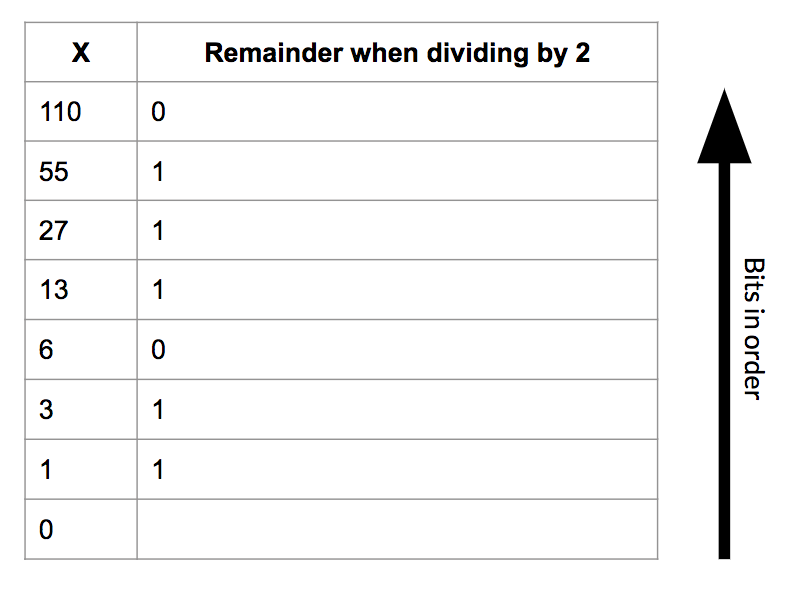
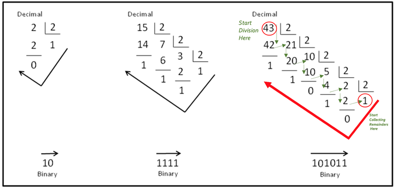
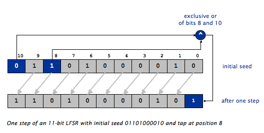

### 0. Getting Started

---

### A. Goals

---

The purpose of this assignment is to gain practice with object-oriented programming, bitwise operators, number systems, and cryptography. The specific goals are to:
- Continue to familiarize yourself with objects in Java.
- Understand the differences between static libraries and non-static objects.
- Implement practical examples of bits and bitwise functions.
- Get a glimpse into the world of modern cryptography.
At the end of the assignment, you will be able to encrypt and decrypt text using a pseudo-random number stream, and reveal messages hidden into images.

---

### B. Background

---

Encryption is the process of encoding messages or information that can only be decoded by people with authorization (usually some sort of key). Good encryption algorithms produce output that looks random to a bystander but is easily decipherable with the correct key.

In Hail, Caesar!, the key was a single character which shifted all characters in the message up the alphabet. This algorithm was far from perfect, and you demonstrated this by writing a function to crack the cipher without having authorization. This exploited the fact that the outputted cipher wasn’t entirely random – some letters appeared an abnormal amount, and this allowed you to find the offset key.

Over the two millennia since Julius Caesar, cryptography has gone a long way. Computers have played an enormous role in developing information communications as well as keeping those communications safe. In this assignment, you will implement and use a `linear feedback shift register (LFSR)` to create a stream of pseudo-random bits. This will help you create a significantly more random cipher.

Once you have written a crypto library, with the necessary functions, you will use it for a practical application: steganography — the practice of hiding secret messages in images in plain sight.


---

### C. Understand the Problem

---

First you will write an LFSR object. Once given a “seed”, it produces a boundless stream of seemingly random bits (1s and 0s). The key feature is that given the same seed, the LFSR will produce the **same stream of bits**. This means that if Alice and Bob both know the same seed, they can produce identical random bit streams.

To encrypt the message, you will perform an **exclusive or** (^) operation between each bit in the message and the LFSR’s sequence of pseudo-random bits. The resulting cipher, after you perform the XOR operations  will appear to be nonsense, like `Kao y{u(x kp }1rkz~|g2rjf@r)`, but when it is XORed again with the same sequence of pseudo-random bits as the first time, the encrypted message can be decrypted into the original message. 

Since an LFSR’s bit stream is completely determined by its given parameters, Alice can produce the same bit stream that Bob used to encrypt a cipher if she knows the seed, and so can decrypt the message through the same process. For this reason, an LFSR encryption scheme is a symmetric key encryption technique (the alternative is an asymmetric scheme, in which different passwords are used for encrypting and decrypting).

---

### D. Designing the Requirements and Interface

---

All of the extra files (image data and readme) you need will be in codio when you start the assignment, and you can download them [here](hw08_base/base.zip) as well. You will be writing the following two classes from scratch. Their APIs are listed below, but each will be elaborated on in later sections of the homework. You **must include all of the functions** listed below in the class under which they are listed. 

```java
public class LFSR
-----------------
public LFSR(String seed, int tapPosition);
public LFSR(int seedLength, int tapPosition);
public String toString();
public int getTapPosition();
public int nextBit();


public class Codec
------------------
public static int[] encode(String str);
public static String decode(int[] bits);
public static void encrypt(int[] message, String seed, int tapPosition);
public static void decrypt(int[] cipher, String seed, int tapPosition);
```

In any class, you may add additional functions and/or instance variables you like, but they **must be private**. A public main for testing is fine, but no additional public functions or instance variables may be added.

---

### 1. Number Systems

---

### A. Binary
Before we move onto writing code, it may be helpful to review number systems. You have been dealing with numbers your entire life - 10, 12, 100, 1, 50001. Something that is often missed in this numerical notation is the base of this number system, which is 10. For example 1210 = 1 * 10<sup>3</sup> + 2 * 10<sup>2</sup> + 1 * 10<sup>1</sup> + 0 * 10<sup>0</sup>. Likewise 5030110 = 5 * 10<sup>6</sup> + 0 * 10<sup>5</sup> + 3 * 10<sup>4</sup> + 0 * 10<sup>3</sup> + 1 * 10<sup>2</sup> + 1 * 10<sup>1</sup> + 0 * 10<sup>0</sup>. This is inherent to us, we have ten toes and ten fingers. However, computers only understand 1s and 0s (it has to do with electric signals). Hence, we must be able to communicate all data to a computer in 1s and 0s.

The binary number system represents numbers in base 2 and deals with powers of 2. For example, 3<sub>10</sub> = 1 * 2<sup>1</sup> + 1 * 2<sup>0</sup> = 11<sub>2</sub>. Likewise 50<sub>10</sub> = 1 * 2<sup>5</sup> + 1 * 2<sup>4</sup> + 0 * 2<sup>3</sup> + 0 * 2<sup>2</sup> + 1 * 2<sup>1</sup> + 0 * 2<sup>0</sup> = 110010<sub>2</sub>. In this way we can translate numbers from the binary system to decimal and vice-versa. 



The diagram above illustrates an easy way to convert from decimal to binary. Here we use long division as a manner of conversion. In the diagram shown below, take a look at the two examples on the right. Either of these examples can be divided into four diagonals (follow the diagonal from upper left to bottom right) of numbers. 

Consider the rightmost example below. The uppermost diagonal is the divisor which will always be 2. The second diagonal (43, 21, 10.....) is the diagonal of dividends/quotients and the bottom most diagonal (1, 1, 0.....) is the diagonal of remainders. The way we proceed is - we divide 43 by 2 which gives 21 as the quotient and 1 as the remainder. 21 then becomes the new dividend and we divide it by 2 to get 10 as the quotient and 1 as the remainder. Progressing in this manner, we end up with 1 as the dividend which we divide by 2 to get 0 as the quotient and 1 as the remainder. We now take the remainders in the opposite direction (from the last remainder back up to the first) to get our binary number which is 101011<sub>2</sub> (for the decimal number 43<sub>10</sub>).



---

### 2. LFSR

---

### A. Understanding the Problem

---

In the first part of this assignment, you will be creating a linear feedback shift register (LFSR). An LFSR is a structure that can produce a stream of pseudo-random bits, which has many practical uses, particularly in cryptography.

The LFSR consists of a **register** of bits and a **tap position**. The register is simply a list of bits that has a fixed size (which should suggest to you a good data structure to implement the LFSR). The **tap position** is simply an index in the register of bits that will be used to create the pseudo-random bits later. When we create an LFSR, we must seed it by providing the initial values in the register.

**There are two steps in producing a pseudo-random bit with a given LFSR:**
1. Shift all bits by one place towards the most significant bit/MSB (the leftmost bit in the diagram).
2. Then, replace the least significant bit/LSB (the rightmost bit) with the exclusive or of the most significant bit that was shifted off of the register and the bit previously in the tap position.

The new least significant bit (rightmost in the diagram) will be the pseudo-random bit produced by the LFSR.

Consider the example below. The following figure shows an LFSR seeded with the initial seed `01101000010` and tap position `8` during the process of producing one pseudo-random bit. Keep in mind that **the tap position is counted from the rightmost (least significant) bit!** This is opposite from the way positions are counted in arrays and strings, but is consistent with the way bit/digit positions are counted in numbers. The first step mentioned above, shifting all the bits one place towards the MSB is designated by the grey arrows separating the two arrays. The second step mentioned above, XORing two bits and replacing the LSB with that result, is shown via the blue-highlighted boxes.



**NOTE THAT THE ARRAY INDICES ARE FROM 10 (left) to 0 (right). This is opposite from how most arrays are diagrammed.**

---

### B. Shift Register Implementation

---

Before you begin writing your `LFSR.java` class, you will want to decide how you want to represent the register of bits within your class. We are leaving this decision up to you, and any working implementation will be accepted. Here are our suggestions:
- an `int[]` containing only 1s and 0s
- a `char[]` containing only '1's and '0's
- a `boolean[]` containing only true and false
- a single `int`, where each bit represents a position in the shift register. This is a more challenging implementation, but will give you a chance to play around with and understand bits and binary better. In this case, your shift register will be limited to 32 bits, and you will need to use the bitwise operators `&` (bitwise AND), `|` (bitwise OR), `<<` (shift left), and `>>` (shift right).

---

### C. Constructor and Methods 

---

Your LFSR class will implement the API described below. This section will provide the details for the constructor and methods:

```java
public class LFSR 
-----------------
public        LFSR(String seed, int tapPosition)     // constructor
public        LFSR(int seedLength, int tapPosition)  // constructor for a random seed
public String toString()                             // string representation of the LFSR
public int    getTapPosition()                       // return the tap position
public int    nextBit()                              // return a random bit and update the LFSR
```

`public LFSR(String seed, int tapPosition)` takes a `String` parameter `seed` whose characters are a sequence of `0`s and `1`s, and an `int` parameter `tapPosition` specifying which position in the register to use as the tap. The constructor should throw an `IllegalArgumentException` with a useful error message if `seed` contains any characters other than `0` or `1`, if `tapPosition` refers to an impossible position in the register (for example, `-1`), or if `seed` is `null`. 

**Note**: remember the `String.charAt()` method, which will be helpful when parsing through `seed`.

`public LFSR(int seedLength, int tapPosition)` takes an `int` parameter `seedLength`, and generates a random seed (i.e. a random string of `0`s and `1`s of length `seedLength`.

The constructor should throw an `IllegalArgumentException` with a useful error message if `seedLength` is not positive or if `tapPosition` refers to an impossible position in the register.

`public String toString()` returns the current bit sequence in the shift register as a `String` of `1`s and `0`s. For example, the code below should print `101011`. This method will help you when debugging.
```java
LFSR lfsr = new LFSR("101011", 3);
System.out.println(lfsr.toString());
```
**Note**: Make sure your `toString()` method works! If it doesn't, all of our automated tests will fail and you will lose lots and lots of points.

`public int getTapPosition()` returns the tap position, as given by the constructor.

`public int nextBit()` performs one step of the LFSR, as described in section 2A and returns the least significant bit (the rightmost bit) in the shift register **after the step has been performed** as an `int` with the value `0` or `1`.

For testing, you should ensure you can run
```java
LFSR lfsr = new LFSR("01101000010", 8);
for (int i = 0; i < 10; i++) {
    int bit = lfsr.nextBit();
    System.out.println(lfsr.toString() + " " + bit);
}
```
which should print
```java
11010000101 1 
10100001011 1
01000010110 0 
10000101100 0 
00001011001 1
00010110010 0 
00101100100 0 
01011001001 1
10110010010 0 
01100100100 0
```

**Before moving on**, you should have tested **all** methods in `LFSR.java` and be confident that it is correctly implemented.

---

### 3. Codec Library

---

### A. ASCII Conversion

---

Before we can begin encrypting and decrypting using our LFSR, we need to implement two functions to encode and decode our messages into ASCII. For instance, the string SENDMONEY maps to the following sequence of ASCII codes:
```java
{ 83, 69, 78, 68, 77, 79, 78, 69, 89 }
```

Remember that you can convert characters in a `String` to their ASCII codes quite easily: use the `charAt()` method to extract a single character, and cast the result to an `int`. (Technically, you're getting the character's Unicode code, but the first 128 characters in the Unicode character set match the ASCII character set exactly.)

Since you will encrypt messages bit-by-bit, not character-by-character, you will need to expand each ASCII code into 7 1s and 0s that correspond to the code's binary representation. (By the time ASCII became the universal standard for encoding characters on computers, most computers used 8-bit bytes. However the communication lines to keyboards, printers, screens, and other computers tended to be very unreliable. To help detect transmission errors, the ASCII standard only uses 7 bits to encode a character and leaves the 8th bit free for error-checking purposes.)

---

### B. Helper Functions

---

To help implement your Codec library, begin by creating two helper functions. Remember, helper functions should be private!

```java
private static int[] charToIntArray(char ch)
private static char intArrayToChar(int[] bitString) 
```

`private static int[] charToIntArray(char ch)` takes in a `character` and converts it to a binary representation of its ASCII value. Specifically, it will return an `int[]` where each element is a single bit (i.e. 1 or 0) in the ASCII encoding of the character `ch` using 7 bits. 

For example, `charToIntArray('C')` should output the array `{ 1, 0, 0, 0, 0, 1, 1 }` because 'C' has an ASCII value of 67 and 67 in binary is 1000011.

**Hint**: first focus on getting the ASCII representation of the `char` as an int (in decimal) and then work out how to find the 7 bits that represent that int. You can do this using standard arithmetic operations or bit-level operators. It's exactly the same process we covered in lecture and recitation for converting decimal numbers to binary or hex. 

`private static char intArrayToChar(int[] bitString)` does the opposite of `charToIntArray(char ch)`. It takes in an `int[]` of length 7 where each element is a single bit (i.e. 1 or 0) in the ASCII encoding of a character `ch` and outputs the character that is encoded. 

For example, `intArrayToChar({ 1, 0, 0, 0, 0, 1, 1 })` should output the character `'C'`.

Make sure you extensively test both helper functions **before** moving on. You should test each function individually as well as together (i.e. make sure that they perform the inverse operation of each other).

---

### C. Encode and Decode

---

For your `Codec.java` library, begin by writing two functions, making use of the helper functions you created in the previous section.

`public static int[] encode(String str)` takes in a `String` and will return an `int[]` where each element is a single bit in the ASCII encoding of the `String`. Each character in `str` will encode into 7 bits, so the output array should be 7 times larger than `str.length()`.

For example, `encode("C")` should output the array `{ 1, 0, 0, 0, 0, 1, 1 }`

- If `str` is `null`, `encode()` should return `null`.
- If any character in `str` has a unicode value >127 (i.e. the character is not part of the ASCII subset of Unicode), your program should throw an `IllegalArgumentException` with an appropriate error message.

**Hint**: Use the helper functions written above to help with this. 

You should **test** `encode()` and be confident before you move on to the next function.

`public static String decode(int[] bits)` will accept an array of `int`s representing a message in ASCII, and will return the decoded `String`. This is simply a reversal of the `encode()` process. Remember, every 7 bits corresponds to one `char`.
- If `bits` is `null`, return `null`.
- If `bits.length` is not a multiple of 7, throw an `IllegalArgumentException` with an appropriate error message.
- If `bits` contains any values other than 0 and 1, throw an `IllegalArgumentException` with an appropriate error message.

Once you have written `encode()` and `decode()`, you should be able to encode any `String` into binary and decode it back into the original string.

--- 

### D. Encrypt and Decrypt

---

Your next task is to write functions to encrypt and decrypt messages by xor-ing them with a sequence of pseudo-random bits generated by the LFSR. The "password" is the set of parameters that define the LFSR (the seed and tap position).

For instance, consider the letter “C" with binary representation `1000011`. Say we construct an LFSR with `01101000010` as the seed and `8` as the tap. This will produce a bit stream of `1100100100`. 

**Note**: The bit stream is not the changed register - it is the compiled string of pseudo-random bits that come from continually calling nextBit() many times on our register. You should use the output of nextBit() as your bit stream.

Encrypting the letter “C" (67 in ASCII, which is represented in binary as 1000011) with this LFSR would be done by:
```java
message bits   1000011
random  bits   1100100
----------------------
encrypted bits 0100111
```

Note that the ith bit in the cipher is the XOR of the ith bit in the message and the ith bit in the random bit stream.

Write `public static void encrypt(int[] message, String seed, int tapPosition)` to perform this encryption. `message` is the message in binary to encrypt, and `seed` and `tapPosition` are the parameters for the LFSR to be used when encrypting. You **should not be returning anything**. Instead, you should be changing the `message` array **in place**. Implement the following error checks, in order:
1. If the seed is `null`, throw an `IllegalArgumentException` with an appropriate error message.
2. If the tap position is impossible, throw an `IllegalArgumentException` with an appropriate error message.
3. If the seed contains any characters other than `'0'` and `'1'`, throw an `IllegalArgumentException` with an appropriate error message.
4. If the message is `null`, do nothing.
5. If the message length is not a multiple of 7, throw an `IllegalArgumentException` with an appropriate error message.
6. If any entry in the message array contains a value other than `0` or `1`, throw an `IllegalArgumentException` with an appropriate error message.

Once you have tested and are confident in `encrypt()` you should write `public static void decrypt(int[] cipher, String seed, int tapPosition)`. This function should be **one line long**.

**Hint**: Exclusive or is symmetric. In practice, this means that if `c == r ^ m` then `m == r ^ c`.

---

### 4. Image Steganography

---

### A. Understanding the Problem

---

Now that you have written a more modern encryption library, you will use it for a practical application: steganography. Image steganography is the science of hiding secret messages inside of images. Think of it as 21st century disappearing ink. The casual observer simply sees an ordinary image; only someone who knows how to look for it will notice or find the message.

Image steganography has many practical uses, particularly for digital watermarking, where a message is hidden so that the image source can be tracked or verified. The FBI has even alleged that Russian intelligence services have used steganography to communicate with agents abroad.

You will implement a simple, but very effective form of image steganography. The idea is to fiddle with each pixel's color in a way that isn't perceivable to the human eye, but that the computer can interpret. Since the human eye is least sensitive to blue wavelengths, we'll slightly adjust the amount of blue in each pixel in a way that encodes a single bit of information.

As far as the computer is concerned, an image is just a 2-D array of pixels. The color of each pixel is an integer between 0 and 16.8 million (2<sup>24</sup> - 1 to be precise), with 8 bits dedicated to each of the red, green, and blue primaries.


Flipping the ones bit of this number (i.e. subtracting 1 from an odd number or adding 1 to an even number) changes the amount of blue in the color by a minute amount that is indistinguishable to the human eye. These two blues are `001001011000010110101110` and `001001011000010110101111`.


Using your `Codec.java` library, you will be decoding a message hidden inside of an image. 

---

### B. `ImageData.java`

---

We have provided you with the `ImageData.java` library for reading and writing images as 2D integer arrays. `ImageData.java` provides three functions:
```java
public static int[][] load(String filename)              // load image filename and return it as a 2-D array of integers
public static void show(int[][] img)                     // display img in a window
public static void save(int[][] img, String filename)    // save img to filename
```

Each element in the 2D integer array corresponds to one pixel in the image. Refer to section 3A to see how each pixel is represented as an `int`.

---

### C. Retrieve Message

---

You should see `RetrieveMessage.java` in your Codio, and you can also download it here. This loads the specified image, extracts the embedded cipher, and prints out the decrypted message. This file has been completed for you and you do not need to change anything. . 

`RetrieveMessage.java` takes three command line arguments:
- the name of the image file (jpg or png format)
- the seed for the LFSR as a string of `0`s and `1`s
- the tap position for the LFSR

If the image has an embedded message that is not encrypted, you only need to pass in the image name and can ignore the second two command line arguments.

In order to test your code with `RetrieveMessage.java`, we have provided `stegosaur_embedded.png` which has a hidden message which is **not encrypted**. We also have `stegosaur_encrypted.png` which contains the same hidden message, but this time encrypted with the seed `01101000010` and tap `8`. You should be able to use `RetrieveMessage.java` to retrieve the messages from both of these images at this point, if you've completed the previous parts of the assignment correctly.

---

### D. Hide Message

---

For the final part of the assignment, you are given `HideMessage.java`, and you can also download it here. This encodes a message into binary, encrypts the message using an LFSR, and hides the message in the least significant bits of an image. the new image will be saved as `filename_hidden.png`. You do not need to change anything in this file. 

`HideMessage.java` takes in four command-line arguments:
- the name of the image file (png format only - jpg will not work)
- the name of the text file containing your message (Note: you create this file yourself)
- the seed for the LFSR as a string of `0`s and `1`s
- the tap position for the LFSR

**Notes**:
- If you want to embed the message but not encrypt it, do not give the `seed` or `tapPosition` command line arguments.
- If the message is too long for the image, it will throw an `IllegalArgumentException` with an appropriate error message.

At this point, you should be able to run `HideMessage.java` and then retrieve the message from the saved image using `RetrieveMessage.java`.

---

### 5. README and Submission

---

### A. README

---

Complete `readme_steg.txt` in the same way you have done for previous assignments.

---

### B. Submission

---

Submit `LFSR.java`, `Codec.java`, and `readme_steg.txt` on Gradescope.

**Before submission, comment out any print statements that were used for debugging or testing your functions and not any print statements that we asked you to insert.**

**Be sure that every method has an appropriate header comment, and that your code is well-documented.**