## 0. Getting Started

---

### A. Goals

The purpose of the Travelling Salesman Problem (TSP) assignment is to practice implementing linked lists. The specific goals are to:

- Implement and use a linked list, a type of recursive data structure.
- Learn about the Travelling Salesman Problem, an important theoretical problem in computer science. 

---

### B. Background

A travelling salesman needs to visit each of n cities exactly once, and arrive back home, keeping the total distance travelled as short as possible. In this assignment, you will write a program to find a path connecting n points that passes through each point exactly once.

The travelling salesman problem is a notoriously difficult combinatorial optimization problem. There does not exist an efficient algorithm to find the optimal tour, the tour of smallest distance. The only way to find the optimal tour is to use brute force: to compute the distance of all possible tours. The problem with this is that there are n! (n factorial) possible tours; enumerating them all and computing their distance would be very slow.

However, there are efficient ways to find a tour that is near-optimal; these methods are called heuristics. You will implement two heuristics to find good (but not optimal) solutions to the traveling salesman problem. You will also implement a simpler method which creates a tour by traveling to points in order. 

|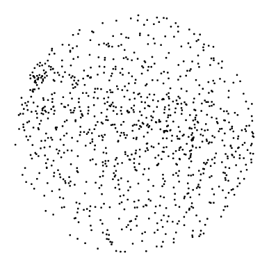|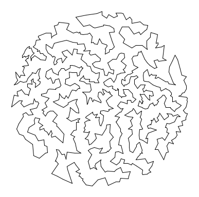|
|**1,000 points**|**Optimal tour through the same 1,000 points**|


The travelling salesman problem has a wealth of applications such as vehicle routing, circuit board drilling, circuit board design, robot control, X-ray crystallography, machine scheduling, and computational biology.

---

### C. Your program

In this assignment, you will write a `Tour` class that models a tour using a linked list of `Point` objects.

You will implement the following methods to insert points into a tour.

- **In-order heuristic** Insert each point at the end of the current tour. This is the easiest to implement.
- **Nearest-neighbor heuristic** Insert each point into the tour after the point already in the tour which is closest to the point to be inserted. 
- **Smallest-increase heuristic** Insert each point into the tour between the two points which would cause the smallest increase in the total tour distance.

---

### D. Designing the Requirement and Interface

Open HW7 on Codio and look at the files provided, or you can download them [here](hw07_base/data.zip). The provided files contain files you can use for testing as well as some helper classes and interfaces you will need:
- `TourInterface.java` outlines the set of methods that your Tour class will have to implement.
- `Point.java` is the class for point objects. Each node in the linked list (Tour) will hold a point object. Point objects are further explained in the next section. 
- `Node.java` represents nodes in your `Tour`'s linked list and is also described in the next section.
- `VisualizeTour.java` is a program that helps you graphically test your `Tour` class as you write it. It takes a single command-line argument—the name of the data file to use; directions for using it are displayed in the window which will appear when you run it.

Review the class material and textbook chapters on linked lists.

---

## 1. Tour Class

In this section, you will write `Tour`, implementing `TourInterface`. The Tour is represented by a linked list which contains nodes. Each node contains a point which is essentially just a coordinate. Make sure you understand the distinction between the Tour, nodes, and points after reading section 1.

---

### A. The `Point` Class
The `Point` class file that represents a point, contained by a node, in a tour. Open it in Codio and study it carefully. The API is as follows:

```java
public class Point
----------------------------------------------------------------------------------------
Point(double x, double y)       // create the Point (x, y)
String toString()               // return String representation
void draw()                    // draw Point using PennDraw
void drawTo(Point that)        // draw line segment between this  
                               // Point and that
double distanceTo(Point that)  // return Euclidean distance 
                               // between this Point and that 
```

---

### B. The `Tour` Class
Create a skeleton for your `Tour` class, which must implement `TourInterface`:

```java
public interface TourInterface
----------------------------------------------------------------------------------------
String toString()                 //create a String representation 
                                  // of the Tour
void draw(Point p)       // draw the Tour using PennDraw
                         // any edge starting or ending at p 
                         // should be in a distinct color
int size()                      // number of Points in this Tour
double distance()               // return the total distance of the 
                                // Tour
void insertInOrder(Point p)     // insert p at the end of the Tour
void insertNearest(Point p)     // insert p using the nearest        
                                // neighbor heuristic	
void insertSmallest(Point p)    // insert p using the smallest   
                                   increase heuristic
```

Write method stubs for each method declaration in the `TourInterface` interface. The stubs  for methods with non-void return types must each return a dummy value so that  `Tour.java` compiles.

Add appropriate header comments and method comments.

---

### C. The `Node` Class
The `Node` class we have provided will form the basis of your `Tour` class's linked list structure. Each `Node` stores a single `Point` in your `Tour`'s path and a reference to the next `Node` in the path. Its API is as follows:

```java
public class Node
--------------------------------------------------------------------------------------
Node(Point p)                // create a Node containing Point p
Node(Node n, Point p)        // create a Node containing Point p and   
                             // with n as its next Node in the list
```

**Declare** (do not initialize yet) the following private fields in your Tour class:
- A `Node` named `head`. This will represent the first `Node` in your `Tour`.
- A `Node` named `lastNode`. This will represent the last `Node` in your `Tour`. **Whenever you append (add) a `Node` to the end of your linked list, it will be placed just before this `Node`.** Essentially the `lastNode` never changes once it is initialized, but the node in the penultimate position of the tour can change.

When your `Tour` class's linked list is not empty, both `head` and `lastNode` must be different instances of the `Node` class (two different objects) yet each Node must  store the **same** `Point` object. That is, there will be two different Nodes in memory each of which contains a reference to one common Point in memory. Note that this is different from having each `Node` refer to distinct `Point` objects with equivalent values. The purpose of this is to represent the cyclical nature of the salesman's route; he begins and ends at his home. **This is a required implementation detail.**

You may not use Java's built-in `LinkedList` class to implement your linked list. You should also **not** write your own class called `LinkedList` since your `Tour` class will handle all linked list functionality.

---

### D. Constructor and `toString()`
Implement a single constructor for your `Tour` class that takes no arguments and creates an empty `Tour`. This means that both `head` and `lastNode` will be null.

`toString()` returns a `String` representation of the `Tour` (the first `Point` should show up at the end as well, just like it does in your linked list structure). Call `toString()` **on each `Point`** to get a `String` representation of the `Point`. Your output must match this description exactly in order to pass the autograder tests.

If the `Tour` is empty (has no Nodes), `toString()` should return the empty String.

**Required Testing:** Add a `main` in which you create an empty tour and print it out. Your program should now simply print a blank line. Once this works, submit and make sure you also pass the empty tour submission test.

---

### E. `insertInOrder()`
To facilitate testing, you will need to implement `insertInOrder()` so you can add Nodes to your tour.

`insertInOrder(Point p)` adds a node storing `Point p` as the “last” node of the `Tour`.

Remember that your `Tour` class should always maintain `lastNode` at the end of the linked list referring to the same `Point` as the first node in the tour.

If the `Tour` is initially empty, make sure that after this method finishes, your linked list contains two `Node` objects, both referring to the same `Point`.

If you need to iterate over your linked list without specifically doing anything to it, you can do the following: 

```java
Node curr = head;
while (curr.next != null) {
	curr = curr.next
}
```

**Required Testing**: Add code to `main` to create nodes with the following four points and add them to your tour using `insertInOrder()`:
- a = (0, 0)
- b = (1, 0)
- c = (1, 1)
- d = (0, 1)

The following image shows the structure of the link list these insertions should create:

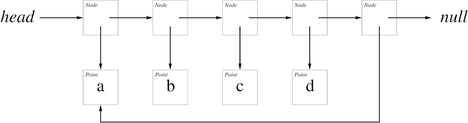

Print out the tour using `System.out.println` You should see the following output (including a blank line at the end):

```
(0.0, 0.0)
(1.0, 0.0)
(1.0, 1.0)
(0.0, 1.0)
(0.0, 0.0)
```

Once this test passes, submit your code and make sure it passes our `toString()` tests for `insertInOrder()` as well. (At this point, your code will still fail the tests for `size()` and `distance()`.)

---

### F. Utility Methods
Implement the `size()`, `distance()`, and `draw()` methods of `Tour`. There are many good ways to implement these methods, using for loops, while loops, or recursion. The choice is up to you.

`size()` returns the number of `Point`s in the `Tour`, (counting the point in Head and lastNode only once).

`distance()` returns the total length of the `Tour` from `Point` to `Point`. Use the `distanceTo(Point p)` method of a `Point` to find its distance to `p`. An empty `Tour` has a distance of `0.0`.

`draw(Point p)` draws the entire `Tour` from `Point` to `Point` using functions that call `PennDraw` code. Both edges adjacent to the input `Point p` should be drawn in a different color (if `p` is `null`, none of the edges should be in a different color). Use the `drawTo(Point q)` method of a `Point` to draw a line from it to `q`. As we have provided `VisualizeTour` to handle setting up PennDraw's canvas for drawing your `Tour`, all this function needs to do is call the `drawTo` method to draw every line segment between adjacent `Points`. If an empty `Tour` calls the `draw` method, the method should simply return without drawing anything.

The image below shows what our reference draws when we call `tour.draw(a)` (refer to section E for the value of `a`). `tour` is the four-point `Tour` we created for testing.


**Required Testing**: Add code to `main` to test each of these methods on an empty tour, a tour containing only one point, a tour containing two points, and a tour containing four points. We encourage you to include additional tests as well. When you are certain all of your own tests work, submit and make sure our tests pass as well.

As you debug your code, you may find this [Java execution visualizer](http://www.cs.princeton.edu/~cos126/java_visualize) helpful. (It was created by [daveagp](https://github.com/daveagp/java_jail).)

---

## 2. Insertion Heuristics

---

### A. Testing with `VisualizeTour`
The `VisualizeTour` program included provides a user interface for you to test the methods you have written in `Tour`. Run it with a filename argument (one of the files we provide) in the terminal to animate the construction of your `Tour`. In the table at the bottom of this page, we have listed the values of `size()` and `distance()` that your methods should obtain for each insert method, as well as the `PennDraw` output that `draw()` should produce.

You might find it helpful to write a helper function that, given a point, inserts a new Node after a given `Node`.

**Required Testing**: Check that your in-order insertion method works for at least the input files `tsp0.txt`, `tsp1.txt`, `tsp2.txt`, `tsp3.txt`, `tsp4.txt`, `tsp5.txt`, `tsp8.txt`, `tsp10.txt`, and `tsp100.txt`. Both the drawing itself, and the size and distance, need to match the reference outputs at the bottom of the page.  **Do not continue until `insertInOrder` works for all these cases!**

---

### B. `insertNearest()`
`insertNearest(Point p)` adds a Node storing the `Point p` to the `Tour` **after** the closest `Point` (Node) already in the `Tour`.

If there are multiple closest `Point`s with equal distances to `p`, insert `p` after the **first** such `Point` in the linked list.

Your method must behave as `insertInOrder()` does **when the linked list is empty.**

**Required Testing**: Make sure your `VisualizeTour` results match the figures below for the Nearest-Neighbor Heuristic for all test cases through `tsp100.txt`. Both the drawing itself, and the size and distance, need to match. Then submit and make sure it passes our submission tests as well.

---

### C. `insertSmallest()`
`insertSmallest(Point p)` adds a Node storing `Point p` to the `Tour` in the position where it would cause the smallest increase in the `Tour`'s distance.

Do not compute the entire `Tour` distance for each position of `p`. Instead, compute the **incremental** distance: *the change in distance from adding `p` between `Point`s `s` and `t` is the sum of the distances from `s` to `p` and from `p` to `t`, minus the original distance from `s` to `t`.*

If there are multiple positions for `p` that cause the same minimal increase in distance, insert `p` in the **first** such position.

Your method must behave as `insertInOrder()` does when the linked list is empty.

If you wrote a helper function when writing `insertInOrder()` that inserts a given `Point` after a given `Node`, you may find it useful again here.

**Comment out all print statements in `Tour` before running `VisualizeTour` on a file of more than 100 `Point`s.** Otherwise, you will be waiting for a long time for `VisualizeTour` to finish.

**Required Testing**: Make sure your `VisualizeTour` results match the figures below for all test cases through `tsp100.txt`. Both the drawing itself, and the size and distance, need to match. Then submit and make sure it passes our submission tests as well.

---

### D. Reference Output
Test your nearest-neighbor heuristic and smallest-increase heuristic methods using `VisualizeTour`. The following are the values and `PennDraw` output that your `Tour` methods should give for each of the provided input files. Note that for the files containing large quantities of points, such as mona-50k.txt, your program may take a long time to build the tour. You may have to wait for several moments, staring at a blank white PennDraw canvas, before your tour is visualized.

{:class="table table-bordered"}
|File| In-Order Insertion(`'o'`) | Nearest-Neighbor Heuristic(`'n'`) | Smallest-Increase Heuristic(`'s'`)|
|:---:|:---:|:---:|:---:|
|`tsp0.txt`|Size: 0 <br> Distance: 0.0000|Size: 0 <br> Distance: 0.0000|Size: 0 <br> Distance: 0.0000|
|`tsp1.txt`|Size: 1 <br> Distance: 0.0000|Size: 1 <br> Distance: 0.0000|Size: 1 <br> Distance: 0.0000|
|`tsp2.txt`|Size: 2 <br> Distance: 632.46 <br> 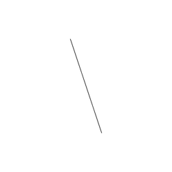|Size: 2 <br> Distance: 632.46 <br> |Size: 2 <br> Distance: 632.46 <br> |
|`tsp3.txt`|Size: 3 <br> Distance: 832.46 <br> 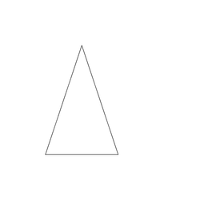|Size: 3 <br> Distance: 832.46 <br> |Size: 3 <br> Distance: 832.46 <br> |
|`tsp4.txt`|Size: 4 <br> Distance: 963.44 <br> 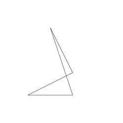|Size: 4 <br> Distance: 956.06 <br> 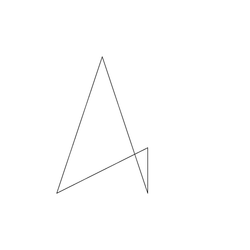|Size: 4 <br> Distance: 839.83 <br> 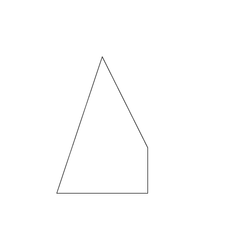|
|`tsp5.txt`|Size: 5 <br> Distance: 2595.1 <br> 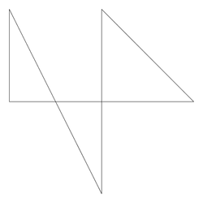|Size: 5 <br> Distance: 2595.1 <br> |Size: 5 <br> Distance: 1872.8 <br> 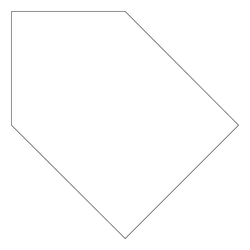|
|`tsp8.txt`|Size: 8 <br> Distance: 3898.9 <br> 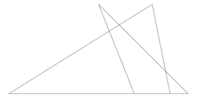|Size: 8 <br> Distance: 3378.8 <br> 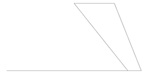|Size: 8 <br> Distance: 2545.6 <br> 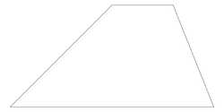|
|`tsp10.txt`|Size: 10 <br> Distance: 2586.7 <br> 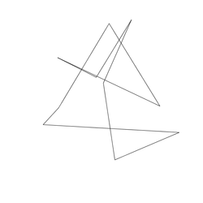|Size: 10 <br> Distance: 1566.1 <br> 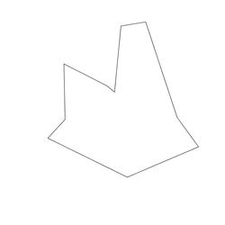|Size: 10 <br> Distance: 1655.7 <br> 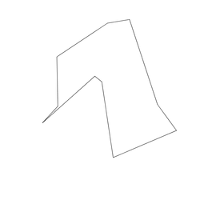|
|`tsp100.txt`|Size: 100 <br> Distance: 25547 <br> 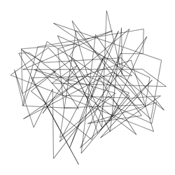|Size: 100 <br> Distance: 7389.9 <br> 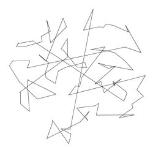|Size: 100 <br> Distance: 4887.2 <br> 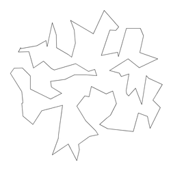|
|`tsp1000.txt`|Size: 1000 <br> Distance: 3.2769e+05 <br> 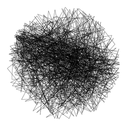|Size: 1000 <br> Distance: 27869 <br> 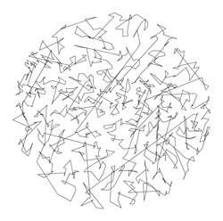|Size: 1000 <br> Distance: 17266 <br> 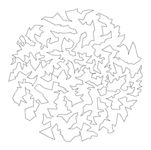|
|`bier127.txt`|Size: 127 <br> Distance: 21743 <br> 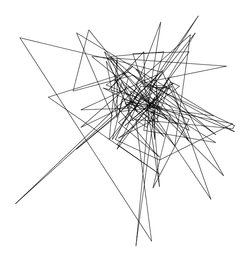|Size: 127 <br> Distance: 6494.0 <br> 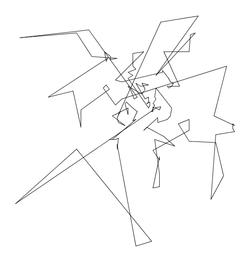|Size: 127 <br> Distance: 4536.8 <br> 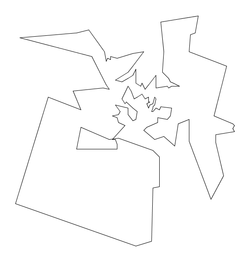|
|`circuit1290.txt`|Size: 1290 <br> Distance: 4.303e+05 <br> 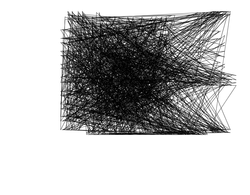|Size: 1290 <br> Distance: 25030 <br> 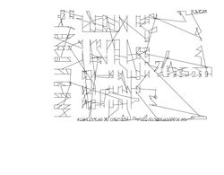|Size: 1290 <br> Distance: 14596 <br> 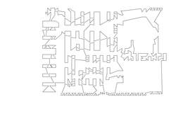|
|`germany15112.txt`|Size: 15112 <br> Distance: 4.2116e+06 <br> 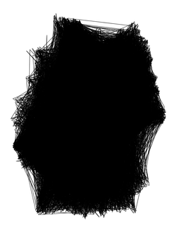|Size: 15112 <br> Distance: 93119 <br> 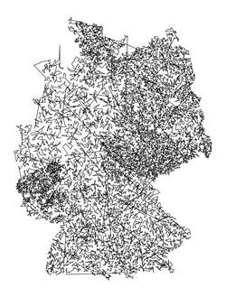|Size: 15112 <br> Distance: 55754 <br> 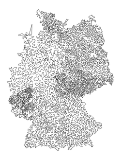|
|`mona-20k.txt`|Size: 20000 <br> Distance: 4.9650e+06 <br> 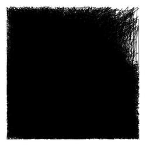|Size: 20000 <br> Distance: 94894 <br> 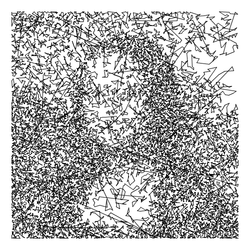|Size: 20000 <br> Distance: 56334 <br> 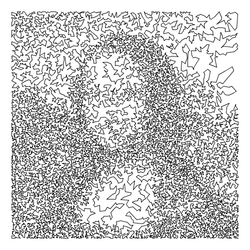|
|`mona-50k.txt`|Size: 50000 <br> Distance: 1.2366e+07 <br> |Size: 50000 <br> Distance: 1.6168e+05 <br> 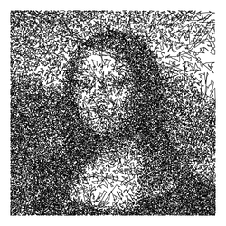|Size: 50000 <br> Distance: 95598 <br> 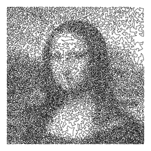|
|`mona-100k.txt`|Size: 100001 <br> Distance: 2.4795e+07 <br> |Size: 100001 <br> Distance. 2.6272e+05 <br> 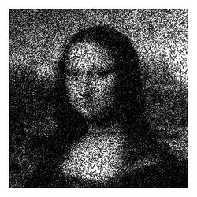|Size: 100001 <br> Distance: 1.5472e+05 <br> 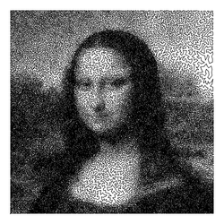|
|`usa13509.txt`|Size: 13509 <br> Distance: 3.9108e+06 <br> |Size: 13509 <br> Distance: 77450 <br> 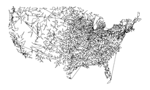|Size: 13509 <br> Distance: 45075 <br> 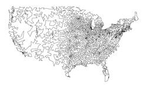|

---

## 3. Extra Credit

---

### A. Extra Credit
For extra credit, implement a better heuristic in a class `TourEC` that implements the `TourECInterface` interface. You are not required to use the `Tour` or `Point` classes for your extra credit solution. **If you use a modified version of these classes to implement `TourEC`, include them in your extra.zip**; otherwise, your TA may be unable to compile your code.

Be warned that this is a relatively difficult extra credit, although it gives an opportunity to learn a great deal about an extremely important problem. Try to write a `TourEC` that implements one of the heuristics below.

Here are some heuristics you may choose to implement.

**Farthest insertion** The farthest insertion heuristic is just like the smallest increase insertion heuristic described in the assignment, except that the `Point`s need not be inserted in the same order as the input. Start with a `Tour` consisting of the two `Point`s that are farthest apart. Repeat the following:
- Among all `Point`s not in the `Tour`, choose the one that is farthest from any `Point` already in the `Tour`.
- Insert that `Point` into the `Tour` in the position where it causes the smallest increase in the distance.

You will have to store all of the unused `Point`s in an appropriate data structure, until they get inserted into the `Tour`. If your code takes a long time, your algorithm probably performs approximately n3steps. If you're careful and clever, this can be improved to n2 steps.

**Node interchange local search** Run the original greedy heuristic (or any other heuristic). Then, repeat the following:
- Choose a pair of `Point`s.
- Swap the two `Point`s in if this improves the `Tour`. For example if the original greedy heuristic returns 1-5-6-2-3-4-1, you might consider swapping 5 and 3 if the `Tour` 1-3-6-2-5-4-1 has a smaller distance.

Writing a function to swap two nodes in a linked list provides great practice with coding linked lists. Be careful, it can be a little trickier that you might first expect (e.g., make sure your code handles the case when the two `Point`s occur consecutively in the original `Tour`).

**Edge interchange local search** Run the original greedy heuristic (or any other heuristic). Then, repeat the following:
- Choose a pair of edges, say 1-2 and 3-4.
- Replace them with 1-3 and 2-4 if the resulting `Tour` 1-3-6-2-5-4-1 has a smaller distance.

This requires some care, as you will have to reverse the orientation of the links in the original `Tour` between `Node`s 3 and 2. After performing this heuristic, there will be no crossing edges in the `Tour`, although it need not be optimal.

---

### B. Enrichment
- The best known tour for `tsp1000.txt` is a solution of distance 15476.519, which was found using the [Concorde TSP solver](http://www.tsp.gatech.edu/concorde.html).
- Georgia Tech's [TSP site](http://www.tsp.gatech.edu/) contains a wealth of interesting information including many applications of the TSP and [two TSP games](http://www.tsp.gatech.edu/games/tspOnePlayer.html).
- Here's a [13,509 city problem](https://www.cis.upenn.edu/~cis110/19fa/hw/hw07/tsp13509.gif) that contains each of the 13,509 cities in the continental US with population over 500. The [optimal solution](https://www.cis.upenn.edu/~cis110/19fa/hw/hw07/tsp13509-sol.jpg) was discovered in 1998 by Applegate, Bixby, Chvatal and Cook using theoretical ideas from **linear and integer programming**. The following [15,112 city problem](https://www.cis.upenn.edu/~cis110/19fa/hw/hw07/tsp15112.pdf) was solved to optimality in April, 2001, and is the current world record. It took 585,936,700 CPU seconds (along with a ton of cleverness) to find the optimal tour through 15,112 cities in Germany.
- Some folks even use the TSP to create and sell art. Check out [Bob Bosch's page](http://www.oberlin.edu/math/faculty/bosch/tspart-page.html). You can even [make your own TSP artwork](http://www.oberlin.edu/math/faculty/bosch/making-tspart-page.html).
- Here is a [New York Times article](http://campaignstops.blogs.nytimes.com/2011/12/21/the-problem-of-the-traveling-politician/) on finding an optimal traveling politician tour in the state of Iowa.
- Here's a [survey article](http://www.research.att.com/~dsj/papers/TSPchapter.pdf) on heuristics for the TSP.

---

## 4. Submission

---

### A. Readme
Complete `readme_tsp.txt` in the same way that you have done for previous assignments.

---

### B. Submission
Submit `Tour.java` and `readme_tsp.txt` on gradescope.

You may also submit a `TourEC.java` file for extra credit. If your `TourEC.java` requires any additional files, **including a modified `Point.java` or `Tour.java`**, make sure to submit those as well.
