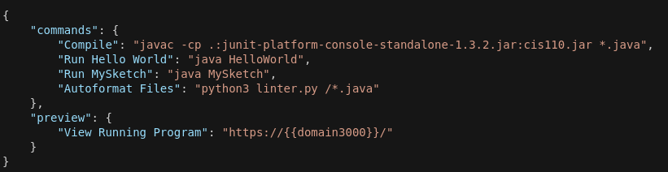

# CIS 110 Codio

## Creating the Assignment
Click the blue pencil in the top right to edit assignments.

Unless it's a brand new assignment, you can copy the assignment from a previous semester. Do this by Add Assignment > Existing and then navigate to the previous semester's version.

If you're setting up a brand new assignment, go to Add Assignment > Project Based. In Step 1, click to see more options > browse > University of Pennsylvania SEAS / CIS 110 Java Stack. Fill in the name field, and leave the memory as standard. Click Create.

If you just want to edit an existing assignment, click the name of it.

## Checking the configuration

Once the assignment has been created, confirm the following configurations are correct.
- Upload the cis110.jar, junit jar, and linter.py files. 
- The config file should look like the below example, with the run buttons changed to be assignment specific.
- The settings file (Codio > Preferences > Project) should have the below lines in the editor section.

### Config Example



### Settings Lines
```
tab_size = 4
ruler = 85
```

## Pushing Changes
Once you've made the changes you need to make, go back to the main list of assignments and click Publish, enter your changes in the changelog, and click Publish. This pushes your changes to everyone else, it **does not** release the homework.

## Publishing the Homework
Leave edit mode (click the blue pencil in the top right) and click the lock next to the name of the assignment. Unlocked means available to students, locked means not available to students.