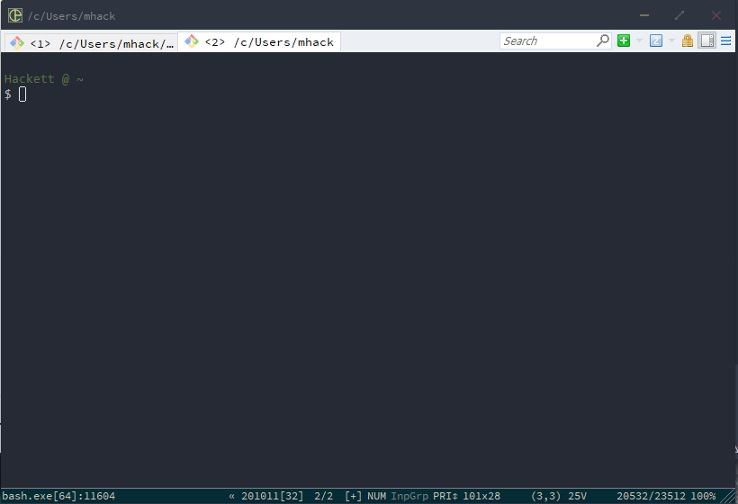
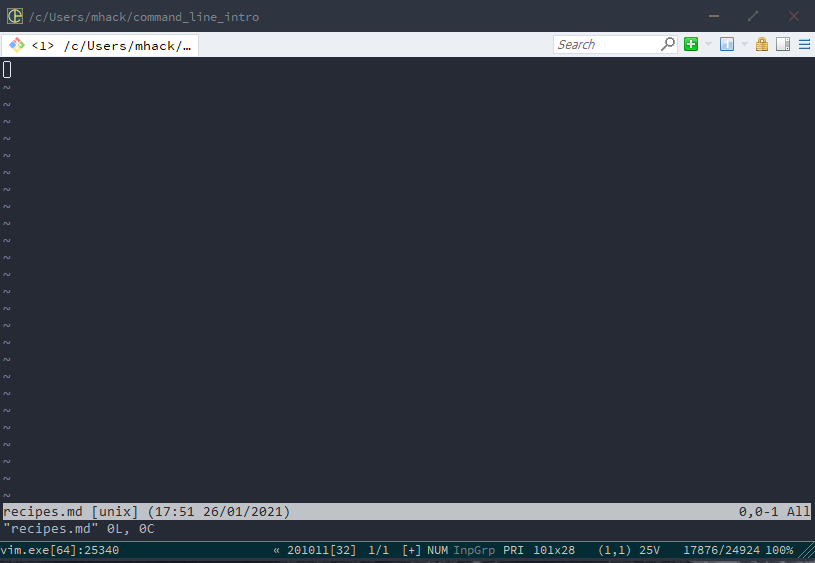
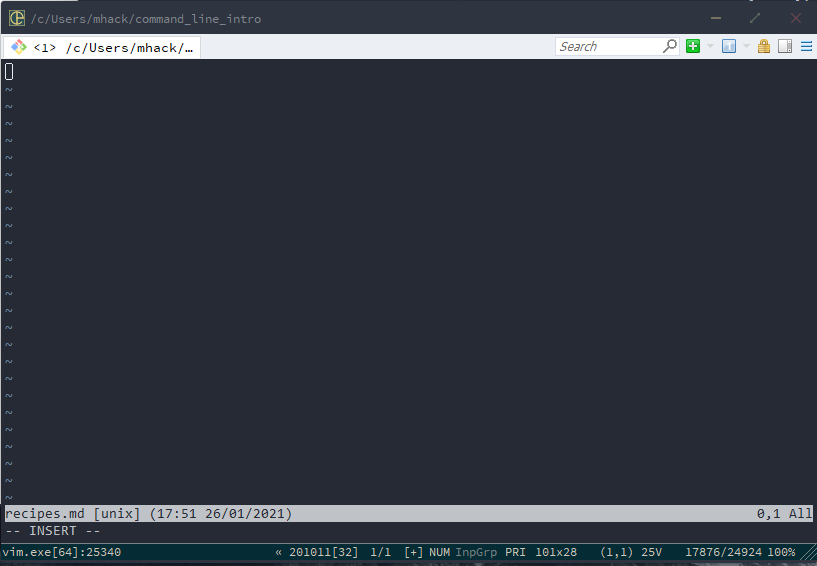

# Command Line

## Preface

Working with the command line may be daunting at first, but a rewarding experience and something you need to learn as an infrastructure committee member. 

## Outline

The purpose of this writeup is to introduce everyone to the following command line skills in an interactive manner:

- File system navigation
- File and folder creation, deletion, and editing with Vim

By the end of this tutorial, you should have the tools you need in order to practice moving around your own filesystem. With time, you may find it's even faster than using your Finder (on Mac) or your GUI file system explorer on whatever OS you are using.

## Disclaimer

This tutorial will assume you are using a Unix command line (or similar, such as Linux). If you have a Mac, you have nothing to worry about. If you are using Windows, you will want to download [Git Bash for Windows](https://www.educative.io/edpresso/how-to-install-git-bash-in-windows) to emulate the same shell<sup>1</sup>.

## Tutorial

### Getting Started

Open up your terminal. On a mac, you can just do cmd+space to open your spotlight search, then type in 'Terminal' and open the corresponding application<sup>2</sup>. If you are on Windows, follow the git bash instructions above and then open a new git bash window. If you are on Linux, you definitely don't need instructions here.

When you open up your terminal, you'll see something like this. Note that I am using an application called ConEmu on Windows and running a Git Bash instance from there. By now, you may have noticed developing on windows is annoying to configure.



### Components of Terminal

On my terminal, you see the text `Hackett @ ~`, a new line, and then the text `$` with the cursor adjacent to it. The `Hackett @` is custom, but the `~` following it is our *working directory*. Let's confirm that with our first command: `pwd`.

```Shell
Hackett @ ~
$ pwd
/c/Users/mhack
```

Notice that the output, `/c/Users/mhack`, is not `~`. This is because `~` is a shortcut that refers to the home directory 🏠. Because we often want to go to our home directory, the shortcut `~` was introduced to not be so annoying.

### Our First Folder

Now that we know where we are in our computer, let's make our first folder. We will use the command `mkdir [folder_name]` to do this - `mkdir` is short for "make directory".

```Shell
Hackett @ ~
$ mkdir command_line_intro
```

When you run this, you'll notice that nothing is printed out. A lot of commands will not provide text output, but they still execute. To make sure, let's list the contents of our working directory using `ls`.

```Shell
Hackett @ ~
$ ls

cis110.jar
command_line_intro
Desktop
Documents
Downloads
penn
```
Here's an abbreviated example of what that will look like for you. You'll see that command_line_intro is one of the entries printed out - that means we made the directory successfully. Let's change our working directory to that folder using the `cd` command.

```Shell
Hackett @ ~
$ cd command_line_intro

Hackett @ ~/command_line_intro
$
```

You'll now notice that our `Hackett @ ~` has changed to reflect that we have changed our working directory. Feel free to use `pwd` to confirm. To go back to your home directory, you can either `cd ~`, which is a good option, but something important to learn is how to go UP one level in your directory hierarchy. To do this, you use two dots - `cd ..` - `..` is shorthand for 'the directory above this one'. To that end, a single dot - `.` - is shorthand for 'this directory'. This is useful to know, as you'll often be navigating in and out of folders.

If you `ls`, you'll see nothing will print out - let's change that by making our first file.

### Our First File

To create a file, use the `touch [filename]` command.

```Shell
Hackett @ ~/command_line_intro
$ touch recipes.md
```

If you now `ls`, you'll see that the file `recipes.md` is listed in the output. Let's print the contents of the file using `cat recipes.md`.

```Shell
Hackett @ ~/command_line_intro
$ cat recipes.md
```

You'll notice that nothing prints out - that's because we haven't added anything to the file yet! We'll do that next. But first, let's talk about how to delete things. You can delete both files and folders using the command `rm`. Let's do that now - we'll make a garbage file and then delete it.

```Shell
Hackett @ ~/command_line_intro   
$ touch garbage.txt              
                                 
Hackett @ ~/command_line_intro   
$ ls                             
garbage.txt  recipes.md          
                                 
Hackett @ ~/command_line_intro   
$ rm garbage.txt                 
                                 
Hackett @ ~/command_line_intro   
$ ls                             
recipes.md                       
                            
```

Now let's make and delete a garbage folder.

```Shell
Hackett @ ~/command_line_intro    
$ mkdir garbage_folder            
                                  
Hackett @ ~/command_line_intro    
$ ls                              
garbage_folder  recipes.md        
                                  
Hackett @ ~/command_line_intro    
$ rm -r garbage_folder            
                                  
Hackett @ ~/command_line_intro    
$ ls                              
recipes.md                        
 
```

Note we used the `-r` flag to note that this was a recursive deletion - if you do not include this, you'll get the error message `rm: cannot remove 'garbage': Is a directory`. Keep in mind that if this folder had things in it, this would delete everything inside the folder as well as the folder itself.

The last navigation commands we need to learn are `cp` and `mv`, for copying, and moving, respectively. Let's make a new folder, make a new file, move that file into the folder, and then copy it back.

```Shell
Hackett @ ~/command_line_intro
$ mkdir inner

Hackett @ ~/command_line_intro
$ touch file.md

Hackett @ ~/command_line_intro
$ mv file.md inner

Hackett @ ~/command_line_intro
$ cd inner

Hackett @ ~/command_line_intro/inner
$ ls
file.md

Hackett @ ~/command_line_intro/inner
$ cd ..

Hackett @ ~/command_line_intro
$ cp inner/file.md .

Hackett @ ~/command_line_intro
$ ls
file.md  inner  recipes.md

Hackett @ ~/command_line_intro
$ ls inner
file.md


```

### Interim Summary

So far, we have covered the following topics and commands

- Open a terminal window and interpret what you see
- Navigate into and out of files
- View the contents in a directory
- See where you are in your file system
- Create and delete a folder
- Create and delete a file
- Copying and Moving items

## Editing Files

### Intro

We now have the tools we need to navigate around our filesystem and interact with the files in an interesting manner. Next up is actually editing these files.

### An Aside

Now, in most circumstances, you can edit files in the IDE of your choice. For example, on Macs you can use the command `open .` to open a GUI file explorer in your current directory, and then can open files with something like Sublime Text if that's what you like to use. You can go a step further and use VS Code as your preferred editor, and then set up the command `code .` to open a new VS Code window in your current directory. That's my preferred method of editing text files.

There are only a handful of circumstances where you have no choice but to use Vim. One of these times is when you are `ssh`ing into another machine, such as the cis 110 course account, which lives on Eniac. Sometimes, it's just more convenient to use Vim, such as editing git commit messages or similar - we'll talk about that next time.

### Vim

Vim is the command line text editor. A competitor is Emacs, but nobody uses that unless they're at least 65 and a luddite. Let's vim into our `recipes.md` file and add a recipe.

```Shell
Hackett @ ~/command_line_intro
$ vim recipes.md
```

This takes you to a new view. It should look like this:



You are now in the **navigating** Vim view. Let's hit the letter `i` to change to editing view. You'll see this:



Notice that at the bottom of the file, it now says `-- INSERT --` instead of `"recipes.md"` to indicate we have changed functionality. You can now type. You can put whatever you want in here.


Once you're done, hit the escape key to go back to navigating view. Now, hit ":" and then type "wq" and hit enter. This tells Vim to save your changes to the file and quit Vim. Now you should be back at your normal terminal view. Let's make sure we did everything right by `cat`ing the contents of `recipes.md`.

```Shell
Hackett @ ~/command_line_intro
$ cat recipes.md
# Recipes

## Fried Eggs

Ingredients: Egg

Hackett @ ~/command_line_intro
$
```

## Conclusion

You now know how to use your terminal for navigation, file/folder creation, editing, viewing, and deletion. You should practice on your own to get comfortable using the command line in your day-to-day work.

## Supplemental Material

1. A shell is the interface between you and your operating system. The job of the shell is to transform commands you type into the terminal into machine instructions that the operating system can execute. It is the outer-most layer of an operating system, with the kernel being the core of the OS. In other words, you interact with the shell and the shell interacts with the kernel.
2. If you want a better looking terminal on macs, I recommend using iTerm2. It's prettier and will make you feel fancier.