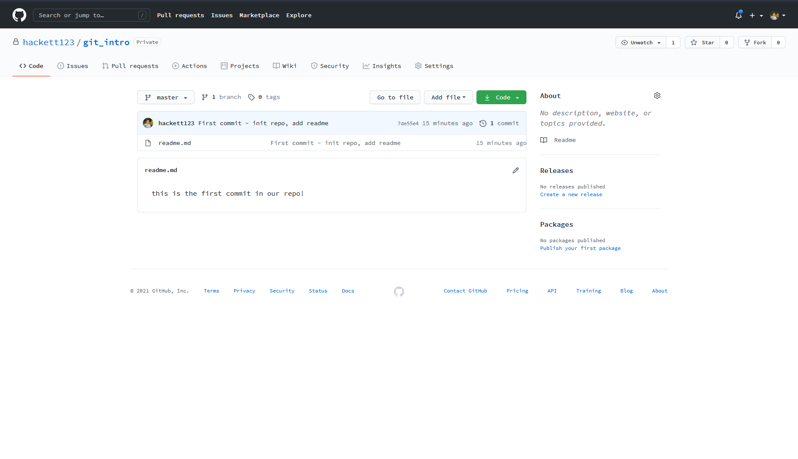

# Git

## Preface

Git is a version control software used used by the biggest companies in the world to maintain their software releases. [Originally written by the same guy who made Linux](https://en.wikipedia.org/wiki/Linus_Torvalds) because he was annoyed no good source control existed, it has taken over worldwide and is probably one of the most important pieces of software ever made.

In cis110, we use `git` to maintain the course website, store scripts we're writing, and track versions of these infra committee writeups.

## Outline

The purpose of this writeup is to introduce everyone to the using git on the command line, and will discuss the following:

- The problems git solves
- How to use git locally
- How to link git to a remote server

By the end of this tutorial, you should have the tools you need in order to use git for your own projects, and be ready to start working with the cis110 repositories.

## Disclaimer

If you **hate** the command line, there is a GUI version of git called Github Desktop. I've never used it and encourage everyone to learn it through the command line - the commands are more verbose and you'll have better control over your repositories.

## Walkthrough

### Git as a Solution

Git helps with two problems:

1. Tracking versions of your code
2. Writing code with other people

There are always times when your code goes from working to not working, at which point it would be really nice to be able to restore your code back to a point where it was working. And as you work on larger projects with other people, git helps you share code in a scalabe and safe way. If you ever find yourself zipping a folder and emailing it to your project members, stop doing that and also don't tell me 👀 just use git!

### Software Setup

Follow [these instructions](https://git-scm.com/book/en/v2/Getting-Started-Installing-Git) from the official git site to get git on your system - you may already have it installed and configured.

### Initializing a Repository

A repository is a workspace of code tracked by git. Let's open up a terminal, `mkdir` a new folder called `git_intro`, `cd` into it, and then run the following:

```Shell
Hackett @ ~/git_intro
$ git init
Initialized empty Git repository in C:/Users/mhack/git_intro/.git/

Hackett @ ~/git_intro (master)
$
```

Note the output "Initialized empty Git repository in ...git_intro/.git". If you `ls`, you won't see a `.git` folder - that's becuase it's hidden by default. Do `ls -a` to see it. You can `ls` it's contents and will see this:

```Shell
Hackett @ ~/git_intro (master)
$ ls .git
config  description  HEAD  hooks  info  objects  refs
```

There's your repository - you don't need to EVER interact with the .git directory (that's why it's hidden!)

### Our First Commit

Git tracks versions of your code through **commits**. Each commit is a snapshot of the state of your code base, and you can look at the differences between commits, as well as go back to a previous version of your code by checking out the corresponding commit. "Committing" a file means you are taking a new snapshot of your codebase with whatever changes you have introduced since the last time you committed. In general, it is better to overcommit than to undercommit.

Paste this into your terminal:

```Shell
touch readme.md && echo "this is the first commit in our repo!" > readme.md
```

Now type "git status" into your terminal. You should see something like this:
```Shell
Hackett @ ~/git_intro (master)
$ git status
On branch master

No commits yet

Untracked files:
  (use "git add <file>..." to include in what will be committed)

        readme.md

nothing added to commit but untracked files present (use "git add" to track)

Hackett @ ~/git_intro (master)
$
```

You'll notice it tells you "On branch master". We'll talk more about branches later. For now, stage your file to be committed using the command `git add .` - this will stage all files in the working directory to be committed. "Staging" means the file will be included the next time you issue a commit command.

```Shell
Hackett @ ~/git_intro (master)
$ git add .

Hackett @ ~/git_intro (master)
$ git status
On branch master

No commits yet

Changes to be committed:
  (use "git rm --cached <file>..." to unstage)

        new file:   readme.md


Hackett @ ~/git_intro (master)
$
```

Now git tells you it has a file to be committed - it is a new file, meaning git hasn't seen it before, and it's called readme.md. Let's now commit that file and take the first snapshot of our code. We'll use the command `git commit -m "useful message here"`

```Shell
Hackett @ ~/git_intro (master)
$ git commit -m "First commit - init repo, add readme"
[master (root-commit) 7de55e4] First commit - init repo, add readme
 1 file changed, 1 insertion(+)
 create mode 100644 readme.md

Hackett @ ~/git_intro (master)
$
```
You'll see in this output message a few things of interest - it tells us that we are on branch master, tells us the commit hash, and relays our message back to us. It also tells us the number of files we changed and line changes (insertions and deletions, but we have no deletions). Let's take a look at our `git log` to see all of our commits at once.

```Shell
Hackett @ ~/git_intro (master)
$ git log
commit 7de55e4437e5aad1601f33a6f86638611001cf2c (HEAD -> master)
Author: Michael Hackett <hackett1@sas.upenn.edu>
Date:   Tue Jan 26 19:00:15 2021 -0500

    First commit - init repo, add readme

Hackett @ ~/git_intro (master)
$
```

We only have one commit in our repository so far - git log will show you all the commits you have (sometimes in a Vim window, just so you're aware) in descending order from newest to oldest.

### Linking to Remote Server

If you've ever linked a local repository with one on GitHub, what you've done is linked your repository to the cloud. There are two popular ways to host a git server remotely - one is through GitHub, and is what almost everyone uses, and the other is to use the ssh protocol, which almost nobody uses. There are a couple of reasons to use GitHub to host your repository remotely:

1. You need to work with other people - this is a big one! You can't exactly use git for collaboration if you all are using local git repos.
2. Keeping your repo safe - git is just about a perfect version control software, but if you break your laptop and never stored your repo on github, you will suddenly have zero versions of your code.
3. GitHub is good at what it does - you could try to host the repo remotely yourself on your own server, but the odds are the people running GitHub have figured out how to do it better than you'll be able to, and while you're a student, private repos are free anyway.

Let's link to GitHub. Log in to GitHub and make a new repository - you can name it git_walkthrough. Once you create it, get the link to the repo - it should look like https://github.com/[username]/[repo_name].git

Back at your terminal, type `git remote add origin <that_url_here>`, followed by `git push -u origin master`. If all went well, you should see this in your terminal:

```Shell
Hackett @ ~/git_intro (master)
$ git remote add origin https://github.com/hackett123/git_intro.git; git push -u origin master
Enumerating objects: 3, done.
Counting objects: 100% (3/3), done.
Writing objects: 100% (3/3), 269 bytes | 269.00 KiB/s, done.
Total 3 (delta 0), reused 0 (delta 0)
To https://github.com/hackett123/git_intro.git
 * [new branch]      master -> master
Branch 'master' set up to track remote branch 'master' from 'origin'.

Hackett @ ~/git_intro (master)
$
```
Now refresh the tab on your GitHub repo and you should see something like this:



Your repository is now being hosted on GitHub!

### Development After First Commit

Now that your repository is being remotely hosted on GitHub, you can simply `git push` and, if you are working with teammates, `git pull` to send changes to your remote and get updates from your remote.

## Interim Summary

At this point, we have covered the following topics:
- Brief history of Git
- Why we use Git
- Getting Git on your computer
- Initializing a repository
- Committing files to our repo
- Pushing changes to a remote repository

This is it for the very basics of Git. There are some intermediate and advanced topics that are worth knowing as well.

## Intermediate Topics

### Branches
Git maintains a tree-like structure of your code, and allows you to "branch" off at certain points. Up until now, we've just been using the default branch, which is called master or main - it was traditionally called master, but after all the BLM protests last summer, GitHub has switched to using the word main, and most Git software has not yet caught up.

Branching is most useful in large repositories with many collaborators, when you want to work on a new feature for a prolonged period of time. When you branch, you create a separate version of the code that is identical to the code you branched off of at the time of creation. However, when you push changes to one branch, it won't be reflected in any other branches. Eventually, you can merge your branch back to main for the changes to be reflected in the version of code that everyone sees and uses, or you can abandon a branch if it turns out to not work out.

The main use cases of a branch include major code refactoring and new features. For both of these cases, you want to be able to push intermediate diffs that may not be fully functional without affecting the progress of everyone else you're working with and without affecting the product you're working on. We don't use these much in 110, because we typically don't make large changes, but they can be very useful for big group projects and are used extensively in industry.

Let's start out by viewing all the branches in one of our repositories. Navigate to a repo you have, and type `git branch -r`. That should print out all branches you have in your local repo, which would the same as the branches in the remote repo if you're synced. At this point, you likely only have one branch.

To create a new branch, you can type `git branch branchName`. Now, if you type `git branch -r`, you should see the new branch you created.

If you ever need to check which branch you're on, you can use `git status`, which prints your branch as the first line. If you do that now, you'll notice that we're still on the main branch - creating a new branch doesn't automatically put you on that new branch.

In order to switch to your new branch, you can type `git checkout branchName`. Now, if you type `git status`, it should show that you've changed branches. If you want to create a new branch and switch to it at the same time, you can also use `git checkout -b branchName` - this is equivalent to creating the branch and then switching to it.

Once you have a branch, you develop just as we did above. When you add or commit changes, they'll be added to whichever branch you're currently on. 

Once you've completed doing whatever your branch was intended to do, it's time to merge it back into the main branch so your code can be used by everyone you're working with. Merging is the most difficult process of working with branches - depending on how long ago you branched away from main, it's possible that it changed significantly in that time, and you will often have to help the computer resolve differences. 

Say we have branchA and branchB and want to merge them together. We can start out by checking out branchA by doing `git checkout branchA`, and then merge branchB in by doing `git merge branchB`. If all goes well, the computer will handle this merge for you. If not, it will print out files with "merge conflicts," where the computer couldn't figure it out, and ask you to fix those conflicts and then commit the changes. If you open one of the files it lists, the merge conflicts should be labelled clearly for you.

It's important to note that merging branches is not a symmetric process - merging branch A into branch B is not the same as merging branch B into branch A. If you're on branch A and merge branch B with it, that replaces branch A with the merged versions of both branches, and it leaves branch B completely untouched. In the case where you have a branch and you're trying to merge back to main, I recommend first merging main into your branch - this way if you mess something up, you haven't messed up the main code that everyone is using. Once that works, you can merge your branch into main, which will be pretty seemless.

### Diffs

### Reverting

## Advanced Topics

### Rebasing

### Squashing Changes

